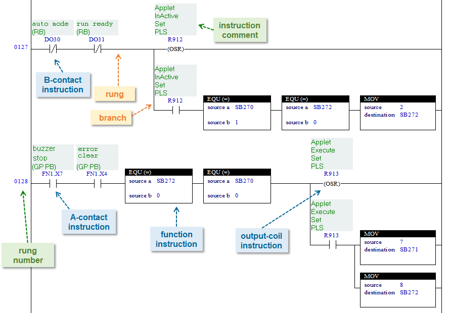
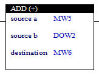
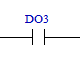
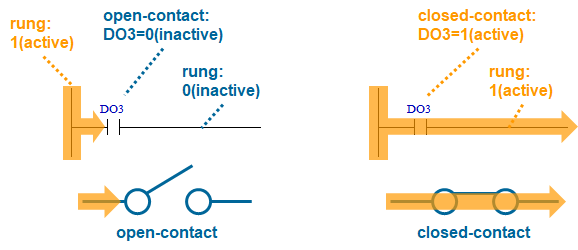
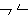
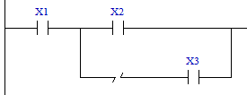
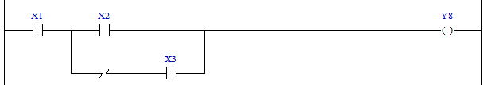
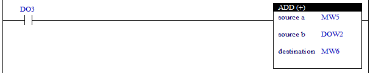
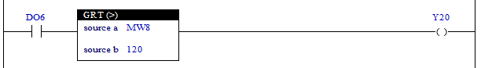

# 1.1 梯形逻辑

梯形逻辑，或称梯形图（LD），是嵌入式PLC的主要编程方法。[除了LD，还有其他方法，如结构化文本（ST）、功能块图（FBD）和顺序功能图（SFC），但嵌入式PLC不支持它们，因此不再进一步讨论。]

梯形程序之所以如此命名，是因为程序的结构类似梯子。信号在梯形结构中流动的水平连接线称为梯级，包含多个指令。



一个机器人教学项目可以包含一个或多个梯形图，每个图可能由十到几百个梯级组成。
当可编程逻辑控制器（PLC）切换到运行模式时，LD将被反复执行。完成一个周期所需的时间称为扫描时间，通常从几毫秒到几十毫秒不等。

<br>

指令由助记符组成，即指令的名称，以及操作数，即要传递给指令的参数。

 例如，下图中的添加（ADD (+)）指令配置如下。



* 助记符：ADD
* 操作数1：MW5
* 操作数2：DOW2
* 操作数3：MW6

<br>

嵌入式PLC的指令可以分为多个指令组，如下所述。由于每个指令将在第4节中进行解释，因此本节中的指令将作为理解梯形逻辑概念的示例进行解释。

---

<br>

### 接触指令

被分类为接触指令的检查是否关闭（XIC）是一个只有一个操作数的简单指令。该指令将在梯级上以标有-| |-符号的操作数表示。



接触是一个开关，决定是否将应用于左侧的信号（1）沿梯级传递到右侧。如果继电器DO3的值为0（非活跃），则接触将处于开放状态，不会传递信号。如果DO3的值为1（活跃），则接触将关闭，允许信号传递。



<br>

当多个XIC接触以串联或并联的形式相连时，可以创建逻辑运算表达式，例如AND、OR和NOT。
(显示了一个反向（INV）指令，旨在将左侧的逻辑值的相反值传递到右侧，并且没有操作数。)

```
X1 AND (X2 OR (NOT X3))
```



<br>

### 输出线圈指令

输出使能（OTE）被分类为输出线圈指令。它总是放置在梯级的最右端，并由-( )-符号表示。该指令允许从左侧传递的值输出到操作数继电器。

如果上述逻辑运算表达式的结果输出到Y8继电器，则将以如下形式表示。

```
Y8 = X1 AND (X2 OR (NOT X3))
```



<br>

### 功能指令

当左侧变为活跃时，将对给定的操作数执行特定操作。例如，在下图中，当DO3变为活跃时，将执行对MW5和DOW2继电器的值进行加法运算ADD (+)，然后将获得的和替换为MW6继电器。

```
IF DO3:
   MW6 = MW5 + DOW2
```



比较指令也将操作结果传递到右侧。例如，在下图中，如果DO6变为活跃且MW8超过120，则Y20将被激活。

```
Y20 = DO6 AND (MW8 > 120)
```

