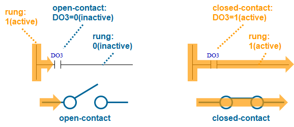

# 1.1 Ladder Logic

Ladder Logic is 내장PLC의 주요 프로그래밍 방식입니다. 이를 Ladder Diagram, 줄여서 LD 라고도 부릅니다. (LD 외에도 ST, FBD, SFC 같은 다른 방식도 있지만 내장PLC가 지원하지 않으므로 설명하지 않겠습니다.)

래더는 프로그램의 모양이 사다리(ladder)와 닮아서 비롯된 이름입니다. 사다리 모양에서 신호가 흘러가는 가로 연결선을 rung이라고 부르며 여러 개의 명령(instruction)들을 포함합니다.


로봇 교시 프로젝트는 래더 다이어그램 1개 혹은 여러 개를 포함할 수 있는데, 각 다이어그램은 수 십 ~ 수 백개의 rung으로 구성됩니다.  
PLC를 RUN 모드로 전환하면 래더 다이어그램이 반복적으로 수행됩니다. 1 cycle에 걸리는 시간을 scan time이라고 하며 보통 수 msec ~ 수 십 msec입니다.


<br>

명령은 명령의 이름인 니모닉(mnemonic)과 명령에 전달되는 인수(argument)인 오퍼랜드(operand)로 구성됩니다.

 예를 들어, 아래 그림의 ADD (+) 명령은 아래와 같이 구성됩니다.


* Mnemonic : ADD
* Operand1 : MW5
* Operand2 : DOW2
* Operand3 : MW6

<br>

내장PLC의 명령은 아래에 설명되는 몇 가지 명령군으로 분류됩니다. 4장에서 모든 명령들이 각각 설명되므로, 이 절에서는 래더 로직의 개념 이해를 위해 일부 명령만을 예로 들어 설명하겠습니다.

---

<br>

## Contact Instruction

접점 명령으로 분류되는 XIC(eXamine If Closed)는 오퍼랜드가 1개만 있는 단순한 명령입니다. -| |- 기호 위에 오퍼랜드가 표기된 형태로 rung에 표시됩니다.


접점은 rung을 따라 왼쪽에 걸린 신호(1)를 오른쪽으로 전달할 지를 결정하는 스위치입니다. 릴레이 DO3 값이 0(inactive)이면 접점이 open되어 전달이 안되고, DO3의 값이 1(active)이면 접점이 close되어 전달됩니다.



<br>

XIC 접점 여러 개를 직렬로 연결하거나, 브랜치(branch)라는 형태로 병렬로 연결하면, AND, OR, NOT의 논리 연산식을 만들 수 있습니다.
(은 왼쪽 논리값의 반대값을 오른쪽으로 전달하는 INV(Inverting) 명령이며, 오퍼랜드가 없습니다.)  

```
X1 AND (X2 OR (NOT X3))
```


<br>


## Output-coil Instruction

OTE(OuTput Energize)는 출력 코일 명령으로 분류됩니다. 항상 rung의 가장 마지막인 오른쪽에 배치되며 -( )- 기호로 표시됩니다. 왼쪽에서 전달받은 값을 오퍼랜드 릴레이로 출력합니다.

앞에서 설명한 논리 연산식의 결과를 Y8 릴레이로 출력한다면 아래와 같은 형태가 됩니다.

```
Y8 = X1 AND (X2 OR (NOT X3))
```


<br>

## Function Instruction

왼쪽이 active되면 주어진 오퍼랜드들에 대해 특정한 동작을 수행합니다. 가령 아래 다이어그램은 DO3가 active 되었을 때 MW5와 DOW2 릴레이의 값을 더해 MW6 릴레이에 대입하는 산술 연산 ADD(+)를 수행합니다.

```
IF DO3:
   MW6 = MW5 + DOW2
```


비교 명령의 경우에는 연산 결과를 오른쪽으로 전달하기도 합니다. 가령 아래 다이어그램은 DO6이 active이고 MW8이 120보다 크면 Y20을 활성화(activate)합니다.

```
Y20 = DO6 AND (MW8 > 120)
```


