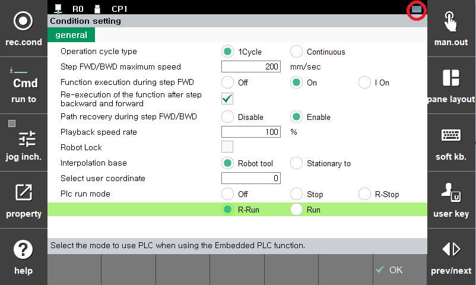

# 2.1. 내장 PLC의 모드 설정

내장 PLC의 동작모드는 "[F7:조건설정] - PLC 동작 모드" 에서 <Off, Stop, R-Stop, R-Run, Run>중 하나를 선택할 수 있습니다.  
R-Stop, R-Run은 Remote-Stop, Remote-Run, 즉 이더넷으로 연결된 PC의 HRLadder 등에서 원격으로 모드변경이 가능한 상태를 의미합니다.

 
 
선택된 모드에 따라 TP화면 우측상단에 아이콘으로 상태를 표시합니다. 즉, PLC=<R-Run이나 Run>상태이면 상기 그림과 같이 PLC 아이콘이 표시되고, PLC=Off인 경우에는 하기 그림과 같이 아이콘이 사라지며, PLC=STOP상태이면 PLC 아이콘에 적색금지마크가 표시됩니다.

 

* Off  
내장 PLC의 기능이 꺼집니다. 이 경우, 로봇제어기의 논리적 출력(Logical Output)인 FB0.DO0~FB9.DO959이 물리적 출력(Physical Output)인 FB0.Y0~FB9.Y959로 자동 출력(bypass)되고, 물리적 입력인 FB0.X0~FB9.X959가 논리적 입력인 FB0.DI0~FB9.DI595로 자동 입력됩니다.

* R-Stop / Stop  
내장 PLC의 동작을 정지시킵니다. R-Stop은 HRLadder에서 변경할 수 있는 리모트(Remote)상태를 나타내며, STOP으로 설정하면 HRLadder에서 동작모드를 변경할 수 없습니다.  
내장 PLC가 Stop될 때에는 PLC의 출력신호인 DI, Y 릴레이가 자동으로 0이 됩니다. *(DI는 로봇언어나 할당의 관점에서는 입력이지만, 내장PLC의 관점에서는 출력입니다.)*  

* R-Run / Run  
내장 PLC를 실행시킵니다. R-Run은 HRLadder에서 변경할 수 있는 리모트(Remote)상태를 나타내며, Run으로 설정하면 HRLadder에서 동작모드를 변경할 수 없습니다. 
