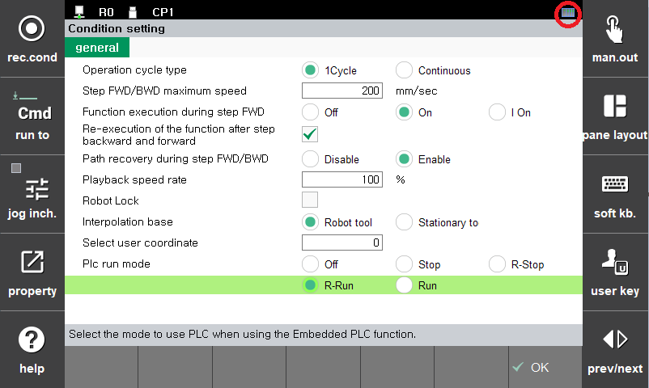

# 2.1. 设置嵌入式PLC的模式

在“[F7: 条件设置] - PLC的操作模式”中，您可以选择关闭、停止、远程停止（R-Stop）、远程运行（R-Run）或运行（Run）模式之一作为嵌入式可编程逻辑控制器（PLC）的操作模式。  
R-Stop和R-Run分别表示远程停止和远程运行，每个状态表示可以通过以太网连接的PC的HRLadder远程更改模式的状态。

 
 
根据所选模式，状态将在教学挂件的屏幕右上角以图标的形式显示。也就是说，当PLC=R-Run或PLC=Run时，将显示PLC图标，如上图所示；在PLC=Off的情况下，PLC图标将消失，如下图所示；在PLC=Stop的情况下，PLC图标上将显示红色禁止标志。

 

* Off  
嵌入式PLC的功能将被关闭。当这种情况发生时，机器人控制器的逻辑输出，FB0.DO0-FB9.DO959，将自动输出为物理输出（即旁路），FB0.Y0-FB9.Y959，物理输入，FB0.X0-FB9.X959，将自动输入为逻辑输入，FB0.DI0-FB9.DI595。

* R-Stop/Stop  
嵌入式PLC的操作将被停止。R-Stop表示可以从HRLadder进行更改的远程状态。如果设置为停止模式，则将无法从HRLadder更改操作模式。  
当嵌入式PLC被停止时，DI和Y继电器，即PLC输出信号，将自动变为0。*(DI是从机器人语言或指令的角度看是输入，但从嵌入式PLC的角度看是输出。)*  

* R-Run/Run  
嵌入式PLC将被执行。R-Run表示可以从HRLadder进行更改的远程状态。如果设置为运行模式，则将无法从HRLadder更改操作模式。  
