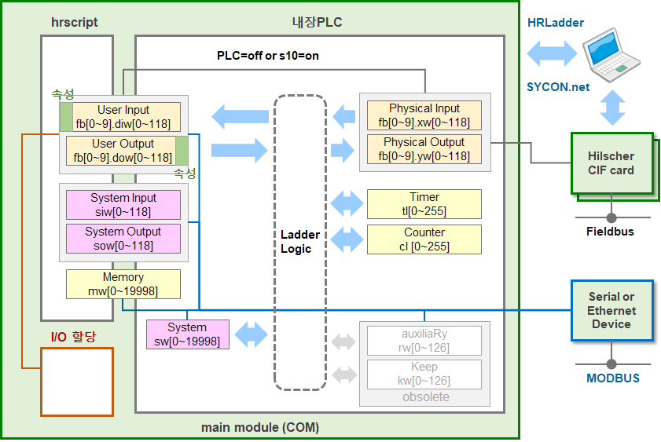

# 3.3 输入/输出图

${cont_model} 机器人控制器的 I/O 图如下所示。

图 3.1 I/O 图

  

图右侧的浅绿色框是 ${cont_model} 控制器内部的硬件模块。左侧是主模块 (COM 模块)，主软件在那里运行。同时，右侧是 Hilscher 通信接口 (CIF) 卡，这是用于连接现场总线的外围组件互连 (PCI) 卡，以及连接 Modbus 的串行或以太网设备。

在主软件中，有各种以小框形式绘制的继电器。在 ${cont_model} 控制器中，有访问这些继电器的软件元素，包括 HRScript（机器人语言）、I/O 分配和嵌入式可编程逻辑控制器 (PLC)。

 

### HRScript（机器人语言）
机器人语言可以通过 I/O 变量访问用户 I/O (FB.DI/DO) 继电器和内存 (M) 继电器。然而，需使用小写字母而不是大写字母（例如，fb3.dow14, mw501.）。有关输入/输出变量的详细信息，请参阅 [${cont_model} 功能手册 - 机器人语言 - I/O 变量](https://hrbook-hrc.web.app/#/view/doc-hrscript/ko/6-external-comm/1-fb-io/1-io-val?cont_model=${cont_model}) 部分。

 

### I/O 分配，I/O 属性
I/O 分配可以访问 FB.DI/DO 继电器。此外，可以通过设置 I/O 属性在 FB.DI/DO 中设置负逻辑、脉冲等。例如，对于“外部停止”，这是一个输入分配，如果在 DI24 中设置了负逻辑，当 DI24 信号为 0（有效）时，机器人将停止。有关更多详细信息，请参阅 [${cont_model} 操作手册 - 输入/输出信号设置](https://hrbook-hrc.web.app/#/view/doc-hi6-operation/ko-tp630/7-setting/3-control-parameter/2-io-signal-setting/README?cont_model=${cont_model}) 部分。

 

### 嵌入式 PLC
梯形图在嵌入式 PLC 框内以虚线绘制，该部分与两侧的继电器通过箭头连接。梯形图从继电器接收输入，执行作者意图的算术/逻辑操作，然后将结果值传递给其他继电器。

由于梯形图双向连接到内存、系统、计时器和计数器继电器，因此它可以从继电器读取值并写入值。另一方面，FB.Y（物理输出）只能写入值，而 FB.X（物理输入）只能读取值。

FB.DI 从机器人语言的角度来看是一个输入，但这个输入是通过嵌入式 PLC 进入控制器的逻辑输入。换句话说，从嵌入式 PLC 的角度，它是一个输出。因此，梯形图只能写入它。同样，由于 FB.DO 从嵌入式 PLC 的角度来看是一个输入，梯形图只能从中读取。

 

### 连接到外部通信
Hilscher CIF 卡需要连接到物理输入和输出。有关如何将一个或多个现场总线对象映射到特定 CIF 卡的信息，请参阅 [${cont_model} 操作手册 - I/O 信号设置 - DIO 块分配](https://hrbook-hrc.web.app/#/view/doc-hi6-operation/ko-tp630/7-setting/3-control-parameter/2-io-signal-setting/9-dio-block-assign?cont_model=${cont_model})。

所有继电器都映射到 Modbus 从功能的地址空间。有关更多详细信息，请参阅 [${cont_model} 功能手册 - Modbus](https://hrbook-hrc.web.app/#/view/doc-modbus/ko/README?cont_model=${cont_model})。