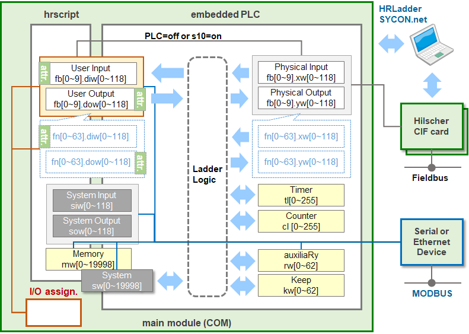

# 3.3 입출력 Diagram

Hi6 로봇제어기의 입출력 Diagram은 다음 그림과 같습니다.

그림 3.1 입출력 Diagram

@@@ SIW, SOW를 SW 내부에 포함? (for 이름 혼동 방지. Hi5a와의 유사성.)

  

그림의 연두색 박스들은 Hi6 제어기 내부의 하드웨어 모듈들입니다. 좌측에는 main 소프트웨어가 구동되는 main module (COM)이 있습니다.우측에는 필드버스 연결을 위한 PCI 카드인 Hilscher CIF card 들과 MODBUS 연결을 위한 시리얼 혹은 이더넷 디바이스가 있습니다.  

main 소프트웨어 내에는 각종 릴레이들이 작은 박스의 형태로 그려져 있습니다. Hi6에서 이 릴레이에 접근하는 소프트웨어 요소는 hrscript(로봇언어)와 입출력 할당(I/O assignment), 그리고 내장PLC입니다.

 

## hrscript (로봇언어)
로봇언어는 입출력 변수를 통해 User I/O (FB.DI/DO) 릴레이와 Memory (M) 릴레이에 접근할 수 있는데, 대문자대신 소문자가 사용됩니다 (e.g. fb3.dow14, mw501). 입출력 변수에 대한 자세한 내용은 [Hi6 기능설명서 - 로봇언어 - 입출력변수](https://hrbook-hrc.web.app/#/view/doc-hrscript/korean/6-external-comm/1-fb-io/1-io-val) 절을 참고하십시오.

 

## 입출력 할당, 입출력 속성
입출력 할당은 FB.DI/DO 릴레이에 접근할 수 있습니다. 또한 입출력 속성 설정으로 부논리, 펄스 등을 FB.DI/DO에 설정할 수 있습니다. 예를 들어 입력 할당인 "외부 정지"에 DI24가 부논리로 설정되어 있으면, DI24 신호가 0(active)일 때 로봇은 정지합니다.  
자세한 내용은 [Hi6 조작설명서 - 입출력 신호 설정](https://hrbook-hrc.web.app/#/view/doc-hi6-operation/korean-tp630/7-setting/3-control-parameter/2-io-signal-setting/README) 절을 참조하십시오.

 

## 내장PLC
내장PLC 박스 안쪽에 점선으로 Ladder Logic이 그려져 있고 양 옆의 릴레이들과는 화살표로 연결되어 있습니다. Ladder Logic은 릴레이들의 입력을 받아 작성자가 의도한 산술적/논리적 연산을 수행한 후 다른 릴레이로 값을 전달합니다.  

Ladder Logic은 Memory와 System, Timer, Counter 릴레이와는 양방향으로 연결되어 있어 이들 릴레이에 값의 읽기와 쓰기를 모두 할 수 있습니다. 반면 물리적 출력인 FB.Y에는 쓰기만 가능하고 물리적 입력인 FB.X에는 읽기만 가능합니다.  

FB.DI는 로봇언어의 관점에서는 입력이지만, 이 입력은 내장PLC를 거쳐서 들어오는 제어기 내부의 논리적 입력입니다. 즉, 내장PLC의 관점에서는 출력이며 따라서 Ladder Logic은 여기에 쓰기만 할 수 있습니다. 마찬가지로 FB.DO는 내장PLC 관점에서는 입력이기 때문에 Ladder Logic은 읽기만 할 수 있습니다.

 

## 외부 통신 연결
Hilscher CIF card들은 물리적 입출력 I/O와 연결됩니다. 1개 혹은 여러 개의 FB객체를 특정한 CIF card 매핑하는 방법은 [Hi6 조작설명서 - 입출력 신호 설정 - DIO 블록 할당](https://hrbook-hrc.web.app/#/view/doc-hi6-operation/korean-tp630/7-setting/3-control-parameter/2-io-signal-setting/9-dio-block-assign)를 참고하십시오.  

모든 릴레이들은 MODBUS 슬레이브 기능의 주소공간에 매핑되어 있습니다. 자세한 내용은 [Hi6 기능설명서 - MODBUS](https://hrbook-hrc.web.app/#/view/doc-modbus/korean/README)를 참고하십시오.
