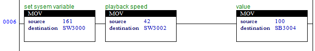

# 3.4.7 S 릴레이 - SYSTEM_VARIABLE

### 시스템 변수 (system variable) 설정


시스템 변수 설정을 위해서는 command 가 변경된 것을 확인하고 동작합니다.  
즉, command 값이 161로 변경된 순간에 1회 동작합니다.  



<table class="tg">
<thead>
	<tr>
		<th>S offset</th>
		<th>field</th>
		<th>description</th>
		<th>type</th>
	</tr>
</thead>

<tbody>
	<tr>
		<td>0</td>
		<td>command</td>
		<td>SET_SYS_VAR (161)</td>
		<td>s2</td>
	</tr>
	<tr>
		<td>2</td>
		<td>param 1</td>
		<td>item (of set data)</td>
		<td>s2</td>
	</tr>
	<tr>
		<td>4 ~ 18</td>
		<td>param n</td>
		<td>value</td>
		<td></td>
	</tr>
</tbody>
</table>

 
 
ex 1) 재생속도 설정
<table class="tg">
<thead>
	<tr>
		<th>S offset</th>
		<th>field</th>
		<th>description</th>
		<th>type</th>
	</tr>
</thead>
<tbody>
	<tr>
		<td>2</td>
		<td>param 1</td>
		<td>42 = 재생속도</td>
		<td>s2</td>
	</tr>
	<tr>
		<td>4</td>
		<td>param 1</td>
		<td>value</td>
		<td>s1</td>
	</tr>
</tbody>
</table>

