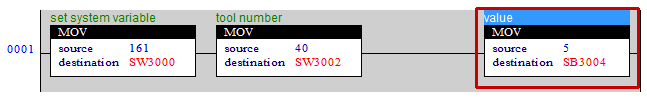

# 3.4.12 S realy - SYSTEM_VARIABLE

### 系统变量设置


要设置系统变量，请检查命令是否已更改并进行操作。  
换句话说，它在命令值变化为161的瞬间操作一次。  



<table class="tg">
<thead>
	<tr>
		<th>S 偏移</th>
		<th>字段</th>
		<th>描述</th>
		<th>类型</th>
	</tr>
</thead>

<tbody>
	<tr>
		<td>0</td>
		<td>命令</td>
		<td>SET_SYS_VAR (161)</td>
		<td>s2</td>
	</tr>
	<tr>
		<td>2</td>
		<td>参数 1</td>
		<td>项（已设置的数据）</td>
		<td>s2</td>
	</tr>
	<tr>
		<td>4 ~ 18</td>
		<td>参数 n</td>
		<td>值</td>
		<td></td>
	</tr>
</tbody>
</table>

 
ex 1) 播放速度设置
<table class="tg">
<thead>
	<tr>
		<th>S 偏移</th>
		<th>字段</th>
		<th>描述</th>
		<th>类型</th>
	</tr>
</thead>
<tbody>
	<tr>
		<td>2</td>
		<td>参数 1</td>
		<td>42 = 播放速度</td>
		<td>s2</td>
	</tr>
	<tr>
		<td>4</td>
		<td>参数 1</td>
		<td>值</td>
		<td>s1</td>
	</tr>
</tbody>
</table>

 
 
ex 2) 工具号码更改
<table class="tg">
<thead>
	<tr>
		<th>S 偏移</th>
		<th>字段</th>
		<th>描述</th>
		<th>类型</th>
	</tr>
</thead>
<tbody>
	<tr>
		<td>2</td>
		<td>参数 1</td>
		<td>40 = 工具号码</td>
		<td>s2</td>
	</tr>
	<tr>
		<td>4</td>
		<td>参数 1</td>
		<td>值</td>
		<td>s1</td>
	</tr>
</tbody>
</table>

