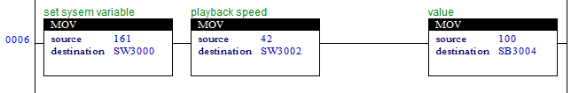

# 3.4.12 S realy - SYSTEM_VARIABLE

### System variable setting


To set system variables, check that the command has changed and operate.  
In other words, it operates once at the moment the command value changes to 161.  



<table class="tg">
<thead>
	<tr>
		<th>S offset</th>
		<th>field</th>
		<th>description</th>
		<th>type</th>
	</tr>
</thead>

<tbody>
	<tr>
		<td>0</td>
		<td>command</td>
		<td>SET_SYS_VAR (161)</td>
		<td>s2</td>
	</tr>
	<tr>
		<td>2</td>
		<td>param 1</td>
		<td>item (of set data)</td>
		<td>s2</td>
	</tr>
	<tr>
		<td>4 ~ 18</td>
		<td>param n</td>
		<td>value</td>
		<td></td>
	</tr>
</tbody>
</table>

 
 
ex 1) Playback speed setting
<table class="tg">
<thead>
	<tr>
		<th>S offset</th>
		<th>field</th>
		<th>description</th>
		<th>type</th>
	</tr>
</thead>
<tbody>
	<tr>
		<td>2</td>
		<td>param 1</td>
		<td>42 = Playback speed</td>
		<td>s2</td>
	</tr>
	<tr>
		<td>4</td>
		<td>param 1</td>
		<td>value</td>
		<td>s1</td>
	</tr>
</tbody>
</table>

