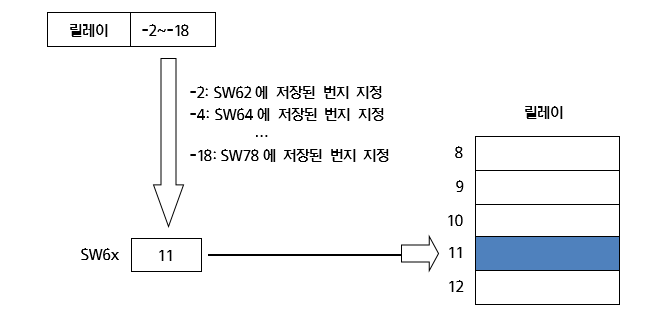
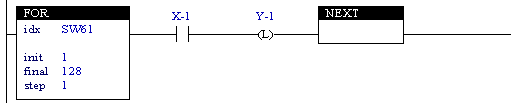

# 3.5 为继电器指定间接地址

SW62-SW79 是用于指定间接地址的系统内存。无论继电器类型如何，如果在继电器地址中指定的值介于 -2 和 -18 之间，则设置的值将导致存储在 SW62-SW79 中的指定继电器地址。

例如，当 SW62-SW79 的某些值如下时，

| **继电器** | **值** |
| :---      | :---      |
| SW62      | 12        |
| SW70      | 3         |
| SW78      | 56        |

间接地址的表示可以解释如下。

*	MW-2 -> MW12
*	FB-10.X3 -> FB3.X3
*	X-18 -> X56
*	FB-10.YW-2 -> FB3.YW12

下面呈现的嵌入式可编程逻辑控制器 (PLC) 示例是使用 FOR/NEXT 指令和间接地址指定方法创建的，将输出信号 Y1-Y128 对应于输入信号 X1-X128。

