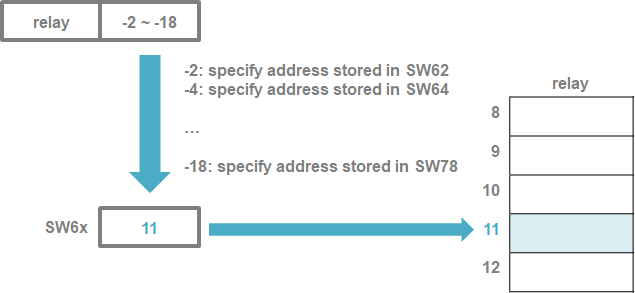
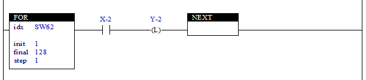

# 3.5 Designating indirect addresses for relays

SW62–SW79 are system memories for designating indirect addresses. Regardless of the relay type, if a value between -2 and -18 is designated for a relay address, the set value will lead to a designated relay address stored in SW62–SW79.

For example, when some of the values for SW62–SW79 are as below,

| **relay** | **value** |
| :---      | :---      |
| SW62      | 12        |
| SW70      | 3         |
| SW78      | 56        |

the notation of an indirect address can be interpreted as follows.

*	MW-2 -> MW12
*	FB-10.X3 -> FB3.X3
*	X-18 -> X56
*	FB-10.YW-2 -> FB3.YW12

The embedded programmable logic controller (PLC) example presented below is an example in which the operation of outputting signals Y1–Y128 corresponding to input signals X1–X128 is created using the FOR/NEXT instructions and indirect address designation method.

