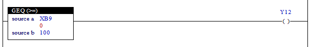

# 4.10 GEQ(Greater Than or Equal) : 크거나 같은지 검사

### 설명
"source a"의 값이 "source b" 의 값보다 크거나 같으면, Rung이 활성 됩니다. (접점활성)

 

### 오퍼랜드로 사용할 수 있는 type
(X는 불가)

<table>
<thead>
  <tr>
    <th>relay type</th>
    <th colspan="2">input X, DO</th>
    <th colspan="2">output Y, DI</th>
    <th colspan="2">memory M, S</th>
    <th>const. 32bit</th>
  </tr>
  <tr>
    <th>data-type</th>
    <th>bit</th>
    <th>B,W,L,F</th>
    <th>bit</th>
    <th>B,W,L,F</th>
    <th>bit</th>
    <th>B,W,L,F</th>
    <th>L,F</th>
  </tr>
</thead>
<tbody>
  <tr>
    <td class='hd'>source a</td>
    <td>X</td>
    <td></td>
    <td>X</td>
    <td></td>
    <td>X</td>
    <td></td>
    <td></td>
  </tr>
</tbody>
<tbody>
  <tr>
    <td class='hd'>source b</td>
    <td>X</td>
    <td></td>
    <td>X</td>
    <td></td>
    <td>X</td>
    <td></td>
    <td></td>
  </tr>
</tbody>
</table>

 

### 사용 예

입력 XB9의 값이 100보다 크거나 같으면 출력 Y12를 on하고, 작으면 off 합니다.

