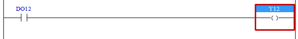

# 4.11 OTE (输出使能): 激活输出

### 描述
输出信号将根据梯级的状态输出。换句话说，如果梯级处于激活状态，输出信号将以 ON（高）状态输出，但如果梯级处于非激活状态，输出信号将以 OFF（低）状态输出。

 

### 可用作操作数的类型
(对于 X 不可能，DO 位从 V60.30-07 开始支持)

<table>
<thead>
  <tr>
    <th>继电器类型</th>
    <th colspan="2">输入 X, DO</th>
    <th colspan="2">输出 Y, DI, R, K</th>
    <th colspan="2">内存 M, S</th>
    <th>常量 32位</th>
  </tr>
  <tr>
    <th>数据类型</th>
    <th>位</th>
    <th>B,W,L,F</th>
    <th>位</th>
    <th>B,W,L,F</th>
    <th>位</th>
    <th>B,W,L,F</th>
    <th>L,F</th>
  </tr>
</thead>
<tbody>
  <tr>
    <td class='hd'>oprd1</td>
    <td>X, -</td>
    <td>X</td>
    <td></td>
    <td>X</td>
    <td></td>
    <td>X</td>
    <td>X</td>
  </tr>
</tbody>
</table>
 

### 使用示例

Y12将在输入DO12的状态下输出。

