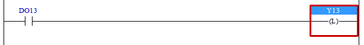

# 4.12 OTL(Output Latch) : 래치 출력

### 설명
Rung이 활성이면, 출력신호를 On(high)으로 출력합니다. 그러나 Rung이 비활성이면, 출력은 변하지 않습니다.

 

### 오퍼랜드로 사용할 수 있는 type
(X는 불가)

<table>
<thead>
  <tr>
    <th>relay type</th>
    <th colspan="2">input X, DO</th>
    <th colspan="2">output Y, DI</th>
    <th colspan="2">memory M, S</th>
    <th>const. 32bit</th>
  </tr>
  <tr>
    <th>data-type</th>
    <th>bit</th>
    <th>B,W,L,F</th>
    <th>bit</th>
    <th>B,W,L,F</th>
    <th>bit</th>
    <th>B,W,L,F</th>
    <th>L,F</th>
  </tr>
</thead>
<tbody>
  <tr>
    <td class='hd'>oprd1</td>
    <td>X</td>
    <td>X</td>
    <td></td>
    <td>X</td>
    <td></td>
    <td>X</td>
    <td>X</td>
  </tr>
</tbody>
</table>

 

### 사용 예

입력 DO13이 on되면 Y13를 on합니다. 이후 DO13이 off 되더라도 Y13은 on을 계속 유지합니다.

