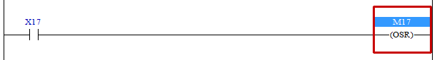

# 4.14 OSR(One Shot Rising) : 원 샷 출력

### 설명
Rung이 활성이면, 한scan 동안만 On(high)으로 출력합니다.  
즉, Rung이 비활성이었다가 활성으로 될 때 한 scan동안만 해당 릴레이가 On됩니다.

 

### 오퍼랜드로 사용할 수 있는 type
(X는 불가)

<table>
<thead>
  <tr>
    <th>relay type</th>
    <th colspan="2">input X, DO</th>
    <th colspan="2">output Y, DI</th>
    <th colspan="2">memory M, S</th>
    <th>const. 32bit</th>
  </tr>
  <tr>
    <th>data-type</th>
    <th>bit</th>
    <th>B,W,L,F</th>
    <th>bit</th>
    <th>B,W,L,F</th>
    <th>bit</th>
    <th>B,W,L,F</th>
    <th>L,F</th>
  </tr>
</thead>
<tbody>
  <tr>
    <td class='hd'>oprd1</td>
    <td>X</td>
    <td>X</td>
    <td></td>
    <td>X</td>
    <td></td>
    <td>X</td>
    <td>X</td>
  </tr>
</tbody>
</table>

 

### 사용 예

입력 X17이 on되면 내부 상태 M17를 on합니다. M17은 해당 scan이 종료할 때 까지만 on을 유지하고 새로운 scan이 시작되면 off 됩니다.

