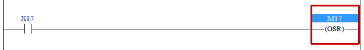

# 4.14 OSR (One Shot Rising): One-Shot-Rising 输出

### 描述
如果该梯级处于活动状态，输出信号仅会在一次扫描的持续时间内输出。换句话说，当梯级从非活动状态切换到活动状态时，相应的继电器将仅在一次扫描的持续时间内处于ON状态。

 

### 可以用作操作数的类型
(对于 X 不可能，DO 位从 V60.30-07 开始支持)

<table>
<thead>
  <tr>
    <th>继电器类型</th>
    <th colspan="2">输入 X, DO</th>
    <th colspan="2">输出 Y, DI, R, K</th>
    <th colspan="2">内存 M, S</th>
    <th>常量 32bit</th>
  </tr>
  <tr>
    <th>数据类型</th>
    <th>位</th>
    <th>B,W,L,F</th>
    <th>位</th>
    <th>B,W,L,F</th>
    <th>位</th>
    <th>B,W,L,F</th>
    <th>L,F</th>
  </tr>
</thead>
<tbody>
  <tr>
    <td class='hd'>oprd1</td>
    <td>X, -</td>
    <td>X</td>
    <td></td>
    <td>X</td>
    <td></td>
    <td>X</td>
    <td>X</td>
  </tr>
</tbody>
</table>

 

### 使用示例

如果输入 X17 处于 ON 状态，内部状态继电器 M17 将处于 ON 状态。M17 将保持在 ON 状态，直到相关扫描完成，如果开始新的扫描，它将切换为 OFF 状态。

