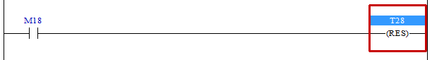

# 4.15 重置 (RES): 重置

### 描述
 如果 rung 处于活动状态，定时器 (T) 或计数器 (C) 继电器值将被清除 (-1)。

 

### 可用作操作数的类型
(不适用于 X)

<table>
<thead>
  <tr>
    <th>继电器 类型</th>
    <th colspan="2">输入 X, DO</th>
    <th colspan="2">输出 Y, DI, R, K</th>
    <th colspan="2">内存 M, S</th>
    <th colspan="2">定时器 T</th>
    <th colspan="2">计数 C</th>
    <th>常量 32bit</th>
  </tr>
  <tr>
    <th>数据 类型</th>
    <th>位</th>
    <th>B,W, L,F</th>
    <th>位</th>
    <th>B,W, L,F</th>
    <th>位</th>
    <th>B,W, L,F</th>
    <th>位</th>
    <th>B,W, L,F</th>
    <th>位</th>
    <th>B,W, L,F</th>
    <th>L,F</th>
  </tr>
</thead>
<tbody>
  <tr>
    <td class='hd'>oprd1</td>
    <td>X</td>
    <td>X</td>
    <td>X</td>
    <td>X</td>
    <td>X</td>
    <td>X</td>
    <td></td>
    <td>X</td>
    <td></td>
    <td>X</td>
    <td>X</td>
  </tr>
</tbody>
</table>

 

### 使用示例

如果内部状态继电器 M18 处于 ON 状态，定时器继电器 T28 将被清除为 -1。

