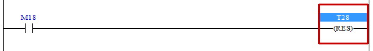

# 4.15 RES(Reset) : 리셋

### 설명
Rung이 활성이면, 타이머(T)나 카운터(C) 릴레이 값을 클리어(-1)시킵니다.

 

### 오퍼랜드로 사용할 수 있는 type
(X는 불가)

<table>
<thead>
  <tr>
    <th>relay type</th>
    <th colspan="2">input X, DO</th>
    <th colspan="2">output Y, DI</th>
    <th colspan="2">memory M, S</th>
    <th colspan="2">timer T</th>
    <th colspan="2">count C</th>
    <th>const. 32bit</th>
  </tr>
  <tr>
    <th>data-type</th>
    <th>bit</th>
    <th>B,W,L,F</th>
    <th>bit</th>
    <th>B,W,L,F</th>
    <th>bit</th>
    <th>B,W,L,F</th>
    <th>bit</th>
    <th>B,W,L,F</th>
    <th>bit</th>
    <th>B,W,L,F</th>
    <th>L,F</th>
  </tr>
</thead>
<tbody>
  <tr>
    <td class='hd'>oprd1</td>
    <td>X</td>
    <td>X</td>
    <td>X</td>
    <td>X</td>
    <td>X</td>
    <td>X</td>
    <td></td>
    <td>X</td>
    <td></td>
    <td>X</td>
    <td>X</td>
  </tr>
</tbody>
</table>

 

### 사용 예

내부 상태 M18이 on되면 T28의 타이머 릴레이를 -1로 클리어 합니다.

