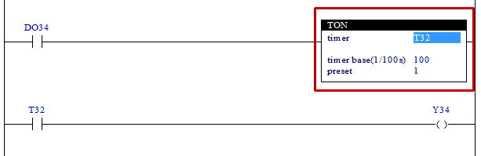

# 4.16 Time on Delay (TON): Timer

### Description
After the time (timer base × preset × 10) [ms] set by calculating the time during which the rung is active, the relevant timer relay will be in the ON (high) state. However, if the rung is inactive, the relevant timer relay will be cleared (-1) immediately. 
Note) The value of T is in units of 1 ms.

 

### Types that can be used as an operand
(not possible for X)

<table>
<thead>
  <tr>
    <th>relay type</th>
    <th colspan="2">input X, DO</th>
    <th colspan="2">output Y, DI, R, K</th>
    <th colspan="2">memory M, S</th>
    <th colspan="2">timer T</th>
    <th>const. 32bit</th>
  </tr>
  <tr>
    <th>data-type</th>
    <th>bit</th>
    <th>B,W,L,F</th>
    <th>bit</th>
    <th>B,W,L,F</th>
    <th>bit</th>
    <th>B,W,L,F</th>
    <th>bit</th>
    <th>B,W,L,F</th>
    <th>L,F</th>
  </tr>
</thead>
<tbody>
  <tr>
    <td class='hd'>timer</td>
    <td>X</td>
    <td>X</td>
    <td>X</td>
    <td>X</td>
    <td>X</td>
    <td>X</td>
    <td></td>
    <td>X</td>
    <td>X</td>
  </tr>
</tbody>
<tbody>
  <tr>
    <td class='hd'>timer base(1/100s)</td>
    <td>X</td>
    <td></td>
    <td>X</td>
    <td></td>
    <td>X</td>
    <td></td>
    <td>X</td>
    <td>X</td>
    <td></td>
  </tr>
</tbody>
<tbody>
  <tr>
    <td class='hd'>preset</td>
    <td>X</td>
    <td></td>
    <td>X</td>
    <td></td>
    <td>X</td>
    <td></td>
    <td>X</td>
    <td>X</td>
    <td></td>
  </tr>
</tbody>
</table>

 

### Example of use

When one second passes after the input DO34 is in the ON state, the timer relay of T32 will be in the ON state. At this time, the output Y34 will be in the ON state.

