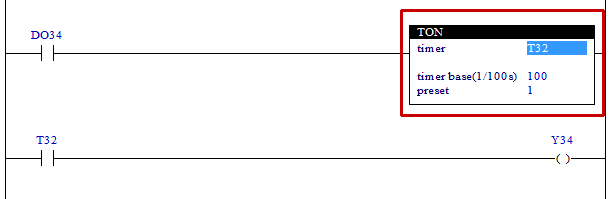

# 4.16 时间延迟 (TON): 定时器

### 描述
在计算了继电器活动期间的时间（定时器基数 x 预设 x 10）[毫秒]后，相关的定时继电器将处于ON（高）状态。然而，如果继电器处于非活动状态，相关的定时继电器将立即被清除 (-1)。 
注意）T的值单位为1毫秒。

 

### 可以作为操作数使用的类型
（不适用于X）

<table>
<thead>
  <tr>
    <th>继电器类型</th>
    <th colspan="2">输入 X, DO</th>
    <th colspan="2">输出 Y, DI, R, K</th>
    <th colspan="2">内存 M, S</th>
    <th colspan="2">定时器 T</th>
    <th>常量 32bit</th>
  </tr>
  <tr>
    <th>数据类型</th>
    <th>位</th>
    <th>B,W,L,F</th>
    <th>位</th>
    <th>B,W,L,F</th>
    <th>位</th>
    <th>B,W,L,F</th>
    <th>位</th>
    <th>B,W,L,F</th>
    <th>L,F</th>
  </tr>
</thead>
<tbody>
  <tr>
    <td class='hd'>定时器</td>
    <td>X</td>
    <td>X</td>
    <td>X</td>
    <td>X</td>
    <td>X</td>
    <td>X</td>
    <td></td>
    <td>X</td>
    <td>X</td>
  </tr>
</tbody>
<tbody>
  <tr>
    <td class='hd'>计时器基准(1/100s)</td>
    <td>X</td>
    <td></td>
    <td>X</td>
    <td></td>
    <td>X</td>
    <td></td>
    <td>X</td>
    <td>X</td>
    <td></td>
  </tr>
</tbody>
<tbody>
  <tr>
    <td class='hd'>预设</td>
    <td>X</td>
    <td></td>
    <td>X</td>
    <td></td>
    <td>X</td>
    <td></td>
    <td>X</td>
    <td>X</td>
    <td></td>
  </tr>
</tbody>
</table>

 

### 使用示例

当输入 DO34 处于 ON 状态后经过一秒时，T32 的定时器继电器将处于 ON 状态。此时，输出 Y34 将处于 ON 状态。

