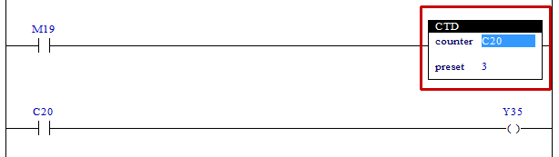

# 4.17 CTD(Count Down) : 카운터

### 설명
Rung의 상승(비활성에서 활성)을 다운-카운트합니다.
해당 C의 값이 0이 되면 해당 카운터가 on(high)으로 되고, 더 이상 카운트 하지 않습니다.
Rung이 활성일 때, 해당 C의 값이 음수이면, preset값을 C에 저장합니다.  
참고) Rung이 비활성이라도 C는 클리어(-1) 하지 않으며 클리어 하기 위해서는 RES 명령어를 실행해야 합니다.  

 

### 오퍼랜드로 사용할 수 있는 type
(X는 불가)

<table>
<thead>
  <tr>
    <th>relay type</th>
    <th colspan="2">input X, DO</th>
    <th colspan="2">output Y, DI</th>
    <th colspan="2">memory M, S</th>
    <th colspan="2">count C</th>
    <th>const. 32bit</th>
  </tr>
  <tr>
    <th>data-type</th>
    <th>bit</th>
    <th>B,W,L,F</th>
    <th>bit</th>
    <th>B,W,L,F</th>
    <th>bit</th>
    <th>B,W,L,F</th>
    <th>bit</th>
    <th>B,W,L,F</th>
    <th>L,F</th>
  </tr>
</thead>
<tbody>
  <tr>
    <td class='hd'>counter</td>
    <td>X</td>
    <td>X</td>
    <td>X</td>
    <td>X</td>
    <td>X</td>
    <td>X</td>
    <td></td>
    <td>X</td>
    <td>X</td>
  </tr>
</tbody>
<tbody>
  <tr>
    <td class='hd'>preset</td>
    <td>X</td>
    <td></td>
    <td>X</td>
    <td></td>
    <td>X</td>
    <td></td>
    <td>X</td>
    <td>X</td>
    <td></td>
  </tr>
</tbody>
</table>

 

### 사용 예

내부 상태 M19가 off에서 on으로 변경되면 C20의 값이 3에서 시작해서 1씩 감소합니다. C20의 값이 0이 되면 카운터 릴레이가 on 됩니다. 이때 출력 Y35가 on 됩니다. 

