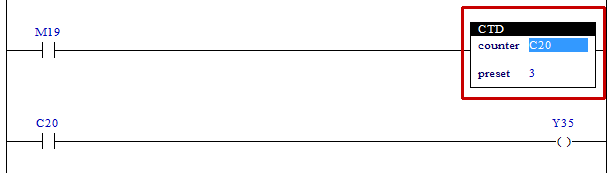

# 4.17 倒计时 (CTD): 计数器

### 描述
梯级的上升（从不活动变为活动）将被倒计时。
如果相关的 C 值变为 0，相关计数器将处于 ON（高）状态，不再进行计数。
当梯级处于活动状态但相关 C 的值为负时，预设值将被存储在 C 中。
注意）即使梯级不活动，C 也不会被清除（-1）。要清除，必须执行 RES 指令。

 

### 可用作操作数的类型
(不适用于 X)

<table>
<thead>
  <tr>
    <th>继电器类型</th>
    <th colspan="2">输入 X, DO</th>
    <th colspan="2">输出 Y, DI</th>
    <th colspan="2">内存 M, S</th>
    <th colspan="2">计数 C</th>
    <th>常量 32bit</th>
  </tr>
  <tr>
    <th>数据类型</th>
    <th>位</th>
    <th>B,W,L,F</th>
    <th>位</th>
    <th>B,W,L,F</th>
    <th>位</th>
    <th>B,W,L,F</th>
    <th>位</th>
    <th>B,W,L,F</th>
    <th>L,F</th>
  </tr>
</thead>
<tbody>
  <tr>
    <td class='hd'>计数器</td>
    <td>X</td>
    <td>X</td>
    <td>X</td>
    <td>X</td>
    <td>X</td>
    <td>X</td>
    <td></td>
    <td>X</td>
    <td>X</td>
  </tr>
</tbody>
<tbody>
  <tr>
    <td class='hd'>预设</td>
    <td>X</td>
    <td></td>
    <td>X</td>
    <td></td>
    <td>X</td>
    <td></td>
    <td>X</td>
    <td>X</td>
    <td></td>
  </tr>
</tbody>
</table>

 

### 使用示例

如果内部状态继电器 M19 从 OFF 状态切换到 ON 状态，C20 的值从 3 开始，继续减少 1。当 C20 的值变为 0 时，计数器继电器将处于 ON 状态。此时，输出 Y35 将处于 ON 状态。

