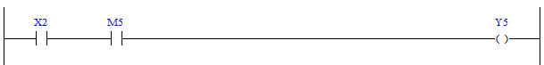

# 4.2 XIC(Examine if Closed) : Close 검사

### 설명
오퍼랜드의 bit 값이 1이면 Rung을 활성(active), 0이면 비활성 합니다.

 

### 오퍼랜드로 사용할 수 있는 type
(X는 불가)

<table>
<thead>
  <tr>
    <th>relay type</th>
    <th colspan="2">input X, DO</th>
    <th colspan="2">output Y, DI</th>
    <th colspan="2">memory M, S</th>
    <th>const. 32bit</th>
  </tr>
  <tr>
    <th>data-type</th>
    <th>bit</th>
    <th>B,W,L,F</th>
    <th>bit</th>
    <th>B,W,L,F</th>
    <th>bit</th>
    <th>B,W,L,F</th>
    <th>L,F</th>
  </tr>
</thead>
<tbody>
  <tr>
    <td class='hd'>oprd1</td>
    <td></td>
    <td>X</td>
    <td></td>
    <td>X</td>
    <td></td>
    <td>X</td>
    <td>X</td>
  </tr>
</tbody>
</table>

 

### 사용 예

A접점 입력 X2인 가동 스위치가 눌린 상태(1=Active)이고, 내부상태 M5가 정상(1)이면 "가동 중 (RUN)" 램프 출력 Y5를 on합니다.

