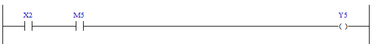

# 4.2 XIC (检查是否关闭): Examining if Closed

### Description
如果操作数的位值为 1，则梯级将被激活。如果为 0，则将被停用。

 

### Types that can be used as an operand
(不适用于 X)

<table>
<thead>
  <tr>
    <th>relay type</th>
    <th colspan="2">input X, DO</th>
    <th colspan="2">output Y, DI, R, K</th>
    <th colspan="2">memory M, S</th>
    <th>const. 32bit</th>
  </tr>
  <tr>
    <th>data type</th>
    <th>bit</th>
    <th>B,W,L,F</th>
    <th>bit</th>
    <th>B,W,L,F</th>
    <th>bit</th>
    <th>B,W,L,F</th>
    <th>L,F</th>
  </tr>
</thead>
<tbody>
  <tr>
    <td class='hd'>oprd1</td>
    <td></td>
    <td>X</td>
    <td></td>
    <td>X</td>
    <td></td>
    <td>X</td>
    <td>X</td>
  </tr>
</tbody>
</table>

 

### Example of use

当运行开关，也就是输入 X2 的接点 A，处于按下状态 (1 = 激活) 时，内部状态继电器 M5 正常 (1)，则“运行”指示灯输出 Y5 将被打开。

