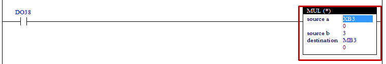

# 4.20 乘法 (MUL)：乘法

### 描述
如果梯级处于活动状态，"源 a" 的值将乘以 "源 b" 的值，结果值将设置在 "目标" 继电器中。如果操作结果发生溢出，将发生设置 S7=1。

 

### 可用作为操作数的类型
(不适用于 X)

<table>
<thead>
  <tr>
    <th>继电器类型</th>
    <th colspan="2">输入 X, DO</th>
    <th colspan="2">输出 Y, DI, R, K</th>
    <th colspan="2">内存 M, S</th>
    <th>常数 32位</th>
  </tr>
  <tr>
    <th>数据类型</th>
    <th>位</th>
    <th>B,W,L,F</th>
    <th>位</th>
    <th>B,W,L,F</th>
    <th>位</th>
    <th>B,W,L,F</th>
    <th>L,F</th>
  </tr>
</thead>
<tbody>
  <tr>
    <td class='hd'>源 a</td>
    <td>X</td>
    <td></td>
    <td>X</td>
    <td></td>
    <td>X</td>
    <td></td>
    <td></td>
  </tr>
</tbody>
<tbody>
  <tr>
    <td class='hd'>源 b</td>
    <td>X</td>
    <td></td>
    <td>X</td>
    <td></td>
    <td>X</td>
    <td></td>
    <td></td>
  </tr>
</tbody>
<tbody>
  <tr>
    <td class='hd'>目的地</td>
    <td>X</td>
    <td>X</td>
    <td>X</td>
    <td></td>
    <td>X</td>
    <td></td>
    <td>X</td>
  </tr>
</tbody>
</table>

 

### 使用示例

如果输入DO38处于活动状态，XB3的值将乘以3，结果值将设置在内部状态继电器MB3中。

