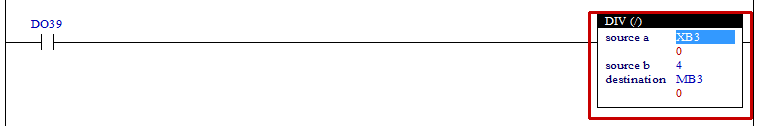

# 4.21 DIV(Divide) : 나누기

### 설명
Rung이 활성이면, "source a"의 값에서 "source b" 의 값을 나누어 "destination" 릴레이에 값을 설정합니다.  
만일, "source b"가 0이거나 연산결과에 오버플로우가 발생하면 S7=1로 설정합니다.

 

### 오퍼랜드로 사용할 수 있는 type
(X는 불가)

<table>
<thead>
  <tr>
    <th>relay type</th>
    <th colspan="2">input X, DO</th>
    <th colspan="2">output Y, DI</th>
    <th colspan="2">memory M, S</th>
    <th>const. 32bit</th>
  </tr>
  <tr>
    <th>data-type</th>
    <th>bit</th>
    <th>B,W,L,F</th>
    <th>bit</th>
    <th>B,W,L,F</th>
    <th>bit</th>
    <th>B,W,L,F</th>
    <th>L,F</th>
  </tr>
</thead>
<tbody>
  <tr>
    <td class='hd'>source a</td>
    <td>X</td>
    <td></td>
    <td>X</td>
    <td></td>
    <td>X</td>
    <td></td>
    <td></td>
  </tr>
</tbody>
<tbody>
  <tr>
    <td class='hd'>source b</td>
    <td>X</td>
    <td></td>
    <td>X</td>
    <td></td>
    <td>X</td>
    <td></td>
    <td></td>
  </tr>
</tbody>
<tbody>
  <tr>
    <td class='hd'>destination</td>
    <td>X</td>
    <td>X</td>
    <td>X</td>
    <td></td>
    <td>X</td>
    <td></td>
    <td>X</td>
  </tr>
</tbody>
</table>

 

### 사용 예

입력 DO39이 활성화 되면 XB3의 값에서 4로 나누어 그 결과를 내부 상태 MB3에 설정합니다.

