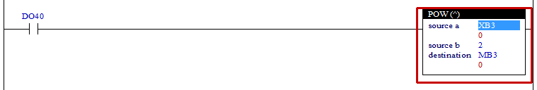

# 4.22 Power (POW): 功率

### Description
如果梯级处于活动状态，"source a"的值将被提升到"source b"的值的幂，结果值将被设置在"destination"继电器中。如果操作结果发生溢出，将设置S7=1。

 

### Types that can be used as an operand
(not possible for X)

<table>
<thead>
  <tr>
    <th>relay type</th>
    <th colspan="2">input X, DO</th>
    <th colspan="2">output Y, DI, R, K</th>
    <th colspan="2">memory M, S</th>
    <th>const. 32bit</th>
  </tr>
  <tr>
    <th>data-type</th>
    <th>bit</th>
    <th>B,W,L,F</th>
    <th>bit</th>
    <th>B,W,L,F</th>
    <th>bit</th>
    <th>B,W,L,F</th>
    <th>L,F</th>
  </tr>
</thead>
<tbody>
  <tr>
    <td class='hd'>source a</td>
    <td>X</td>
    <td></td>
    <td>X</td>
    <td></td>
    <td>X</td>
    <td></td>
    <td></td>
  </tr>
</tbody>
<tbody>
  <tr>
    <td class='hd'>source b</td>
    <td>X</td>
    <td></td>
    <td>X</td>
    <td></td>
    <td>X</td>
    <td></td>
    <td></td>
  </tr>
</tbody>
<tbody>
  <tr>
    <td class='hd'>destination</td>
    <td>X</td>
    <td>X</td>
    <td>X</td>
    <td></td>
    <td>X</td>
    <td></td>
    <td>X</td>
  </tr>
</tbody>
</table>

 

### Use of example

如果输入DO40处于活动状态，XB3的值将被提升到2的幂，结果值将被设置在内部状态继电器MB3中。 

