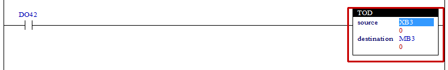

# 4.23 TOD(Convert to BCD) : BCD값으로 변환

### 설명
Rung이 활성이면, "source"의 값을 BCD로 변환하여 "destination"에 저장합니다.  
이 명령은 BCD형식으로 7’세그먼트에 값을 표시하는 장치를 사용할 때 편리합니다.  
만일, "destination"의 데이터 타입이 바이트(B) 형식이면, 2개의 디지트로 변환하고, 워드(W) 형식이면, 4개의 디지트로 변환합니다. "source"의 값이 변환하는 디지트 수 보다 크면, S6=1로 설정합니다.

 

### 오퍼랜드로 사용할 수 있는 type
(X는 불가, u는 부호없는 정수)

<table>
<thead>
  <tr>
    <th>relay type</th>
    <th colspan="2">input X, DO</th>
    <th colspan="2">output Y, DI, R, K</th>
    <th colspan="2">memory M, S</th>
    <th>const. 32bit</th>
  </tr>
  <tr>
    <th>data-type</th>
    <th>bit</th>
    <th>B,W,L,F</th>
    <th>bit</th>
    <th>B,W,L,F</th>
    <th>bit</th>
    <th>B,W,L,F</th>
    <th>L,F</th>
  </tr>
</thead>
<tbody>
  <tr>
    <td class='hd'>source</td>
    <td>X</td>
    <td>u</td>
    <td>X</td>
    <td>u</td>
    <td>X</td>
    <td>u</td>
    <td>u</td>
  </tr>
</tbody>
<tbody>
  <tr>
    <td class='hd'>destination</td>
    <td>X</td>
    <td>X</td>
    <td>X</td>
    <td>u</td>
    <td>X</td>
    <td>u</td>
    <td>X</td>
  </tr>
</tbody>
</table>

 

### 사용 예

입력 DO42이 활성화 되면 XB3의 값을 BCD로 변환하여 그 결과를 내부 상태 MB3에 설정합니다.  
(참고, BCD(Binary Coded Decimal)란 4bit의 코드 값이 0~9범위의 값을 가질 수 있는 숫자를 의미합니다. 즉 BCD에서는 4bit로 표시할 수 있는 숫자 0~F중에서 A~F를 사용하지 않습니다)  
만일 &H7B(123)을 BCD로 변환하면 &H23(35)이 되며 &H7B(123)이 &H63(99)보다 크기 때문에 S6=1로 설정합니다.

