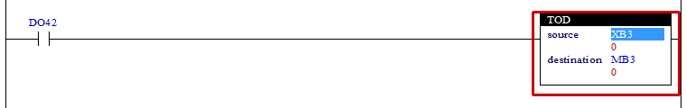

# 4.23 TOD (转换为BCD)：转换为BCD

### 描述
如果梯级处于活动状态，“源”的值将被转换为BCD值，转换后的值将存储在“目的地”中。当使用以BCD格式显示值的7段显示器时，此指令将非常方便。如果“目的地”的数据类型为字节（B）格式，“源”的值将被转换为两个数字。如果为字（W）格式，“源”的值将被转换为四个数字。但是，如果“源”的值大于要转换的数字位数，将发生设置S6=1。

 

### 可用作操作数的类型
（X，不可用于无符号整数u）

<table>
<thead>
  <tr>
    <th>继电器类型</th>
    <th colspan="2">输入 X, DO</th>
    <th colspan="2">输出 Y, DI, R, K</th>
    <th colspan="2">内存 M, S</th>
    <th>常量 32位</th>
  </tr>
  <tr>
    <th>数据类型</th>
    <th>位</th>
    <th>B,W,L,F</th>
    <th>位</th>
    <th>B,W,L,F</th>
    <th>位</th>
    <th>B,W,L,F</th>
    <th>L,F</th>
  </tr>
</thead>
<tbody>
  <tr>
    <td class='hd'>源</td>
    <td>X</td>
    <td>u</td>
    <td>X</td>
    <td>u</td>
    <td>X</td>
    <td>u</td>
    <td>u</td>
  </tr>
<tbody>
  <tr>
    <td class='hd'>目的地</td>
    <td>X</td>
    <td>X</td>
    <td>X</td>
    <td>u</td>
    <td>X</td>
    <td>u</td>
    <td>X</td>
  </tr>
</tbody>
</table>

 

### 使用示例

如果输入的DO42处于活动状态，XB3的值将被转换为BCD值，转换后的值将被设置在内部状态继电器MB3中。 
（注意：二进制编码十进制（BCD）是指其4位代码值可以在0到9之间变化的数字。也就是说，对于BCD数字，0-F中可以用4位表示的数字中的A-F不使用。）
如果&H7B(123)被转换为BCD值，转换后的值将是&H23(35)，并且由于&H7B(123)大于&H63(99)，因此将发生设置S6=1。 

