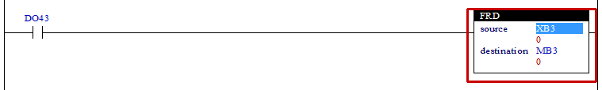

# 4.24 FRD (Convert from BCD to Integer): Converting to an Integer

### Description
If the rung is active, the BCD value of the "source" will be converted to an integer, and the converted value will be stored in the "destination." 
This instruction can be conveniently used when the value of the cam switch outputted in BCD format is received as an input.
If the value of the "source" is not a BCD value, the setting S6=1 will occur.
In addition, if the "source" is in the word (W) format, and the "destination" is in the byte (B) format, the maximum value of the "source" to be converted will be &H9999. Therefore, the result of the conversion to an integer will be 9999 (&H270F), which will cause the byte range &Hff to be exceeded and, accordingly, an overflow to occur. In this case, the setting S=6 will occur.

 

### Types that can be used as an operand
(not possible for X, unsigned integers for u)

<table>
<thead>
  <tr>
    <th>relay type</th>
    <th colspan="2">input X, DO</th>
    <th colspan="2">output Y, DI, R, K</th>
    <th colspan="2">memory M, S</th>
    <th>const. 32bit</th>
  </tr>
  <tr>
    <th>data type</th>
    <th>bit</th>
    <th>B,W,L,F</th>
    <th>bit</th>
    <th>B,W,L,F</th>
    <th>bit</th>
    <th>B,W,L,F</th>
    <th>L,F</th>
  </tr>
</thead>
<tbody>
  <tr>
    <td class='hd'>source</td>
    <td>X</td>
    <td>u</td>
    <td>X</td>
    <td>u</td>
    <td>X</td>
    <td>u</td>
    <td>u</td>
  </tr>
</tbody>
<tbody>
  <tr>
    <td class='hd'>destination</td>
    <td>X</td>
    <td>X</td>
    <td>X</td>
    <td>u</td>
    <td>X</td>
    <td>u</td>
    <td>X</td>
  </tr>
</tbody>
</table>

 

### Example of use

If the input DO43 is active, the value (BCD) of XB3 will be converted to an integer, and the converted value will be set in the internal state relay MB3.
If &H23(35) is converted to an integer, the integer will be &H17(23).

