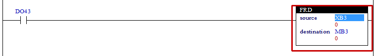

# 4.24 FRD (从 BCD 转换为整数)：转换为整数

### 描述
如果梯级处于活动状态，“源”的 BCD 值将被转换为整数，并且转换后的值将存储在“目标”中。 
当以 BCD 格式接收到凸轮开关输出值作为输入时，此指令可以方便地使用。
如果“源”的值不是 BCD 值，将发生设置 S6=1。
此外，如果“源”以字 (W) 格式表示，而“目标”以字节 (B) 格式表示，则要转换的“源”的最大值为 &H9999。因此，转换为整数的结果将是 9999 (&H270F)，这将导致字节范围 &Hff 被超出，从而发生溢出。在这种情况下，将发生设置 S=6。

 

### 可以作为操作数使用的类型
(对于 X 不可能，u 的无符号整数)

<table>
<thead>
  <tr>
    <th>继电器类型</th>
    <th colspan="2">输入 X, DO</th>
    <th colspan="2">输出 Y, DI, R, K</th>
    <th colspan="2">内存 M, S</th>
    <th>常量 32位</th>
  </tr>
  <tr>
    <th>数据类型</th>
    <th>位</th>
    <th>B,W,L,F</th>
    <th>位</th>
    <th>B,W,L,F</th>
    <th>位</th>
    <th>B,W,L,F</th>
    <th>L,F</th>
  </tr>
</thead>
<tbody>
  <tr>
    <td class='hd'>源</td>
    <td>X</td>
    <td>u</td>
    <td>X</td>
    <td>u</td>
    <td>X</td>
    <td>u</td>
    <td>u</td>
</tr>
</tbody>
<tbody>
  <tr>
    <td class='hd'>目标</td>
    <td>X</td>
    <td>X</td>
    <td>X</td>
    <td>u</td>
    <td>X</td>
    <td>u</td>
    <td>X</td>
  </tr>
</tbody>
</table>

 

### 使用示例

如果输入的 DO43 处于活动状态，则 XB3 的值（BCD）将转换为整数，转换后的值将设置在内部状态继电器 MB3 中。
如果 &H23(35) 被转换为整数，则该整数将是 &H17(23)。

