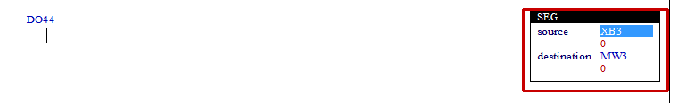
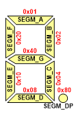

# 4.25 SEG(7'Segment) : 7'세그먼트 값으로 변환

### 설명
Rung이 활성이면, "source"의 값을 7’세그먼트 값(8bit)으로 변환하여 "destination"에 저장합니다.  
"destination"이 워드(W)형식이면, 2개의 7’세그먼트 값(8bit)을 "destination"에 저장합니다.

 

### 오퍼랜드로 사용할 수 있는 type
(X는 불가, u는 부호없는 정수)

<table>
<thead>
  <tr>
    <th>relay type</th>
    <th colspan="2">input X, DO</th>
    <th colspan="2">output Y, DI</th>
    <th colspan="2">memory M, S</th>
    <th>const. 32bit</th>
  </tr>
  <tr>
    <th>data-type</th>
    <th>bit</th>
    <th>B,W,L,F</th>
    <th>bit</th>
    <th>B,W,L,F</th>
    <th>bit</th>
    <th>B,W,L,F</th>
    <th>L,F</th>
  </tr>
</thead>
<tbody>
  <tr>
    <td class='hd'>source</td>
    <td>X</td>
    <td>u</td>
    <td>X</td>
    <td>u</td>
    <td>X</td>
    <td>u</td>
    <td>u</td>
  </tr>
</tbody>
<tbody>
  <tr>
    <td class='hd'>destination</td>
    <td>X</td>
    <td>X</td>
    <td>X</td>
    <td>u</td>
    <td>X</td>
    <td>u</td>
    <td>X</td>
  </tr>
</tbody>
</table>

 

### 사용 예

입력 DO44이 활성화 되면 XB3의 값에 해당하는 7'세그먼트 값을 내부 상태 MW3에 설정합니다.   
만일 &H17인 경우 SEGD_1(SEGM_B|SEGM_C = 0x02|0x04 = 0x06)=&H06과 
SEGD_7(SEGM_A|SEGM_B|SEGM_C = 0x01|0x02|0x04 = 0x07)=&H07이 결합된 &H0607를 MW3에 저장합니다.

 

### 7'세그먼트 데이터

SEGM_A = 0x01 
SEGM_B = 0x02 
SEGM_C = 0x04 
SEGM_D = 0x08 
SEGM_E = 0x10 
SEGM_F = 0x20 
SEGM_G = 0x40 
SEGM_DP = 0x80 

