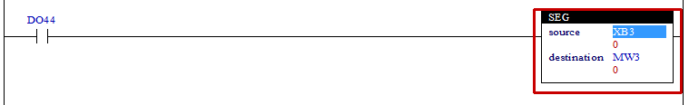
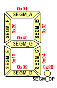

# 4.25 SEG (7-segment): 转换为 7-segment 值

### 描述
如果梯级处于活动状态，“源”的值将被转换为 7-segment 值（8 位），并将转换后的值存储在“目标”中。
如果“目标”是字（W）格式，将在“目标”中存储两个 7-segment 格式的值（8 位）。

 

### 可用作操作数的类型
(对于 X，不可能为无符号整数 u)

<table>
<thead>
  <tr>
    <th>继电器类型</th>
    <th colspan="2">输入 X, DO</th>
    <th colspan="2">输出 Y, DI, R, K</th>
    <th colspan="2">内存 M, S</th>
    <th>常量 32位</th>
  </tr>
  <tr>
    <th>数据类型</th>
    <th>位</th>
    <th>B,W,L,F</th>
    <th>位</th>
    <th>B,W,L,F</th>
    <th>位</th>
    <th>B,W,L,F</th>
    <th>L,F</th>
  </tr>
</thead>
<tbody>
  <tr>
    <td class='hd'>源</td>
    <td>X</td>
    <td>u</td>
    <td>X</td>
    <td>u</td>
    <td>X</td>
    <td>u</td>
    <td>u</td>
  </tr>
</tbody>
<tbody>
  <tr>
    <td class='hd'>目标</td>
    <td>X</td>
    <td>X</td>
    <td>X</td>
    <td>u</td>
    <td>X</td>
    <td>u</td>
    <td>X</td>
  </tr>
</tbody>
</table>

 

### 使用示例

如果输入 DO44 活动，则与 XB3 的值相对应的 7-segment 值将设置在内部状态继电器 MW3 中。
对于 &H17，值 &H0607 结合 SEGD_1(SEGM_B|SEGM_C = 0x02|0x04 = 0x06)=&H06 和 
SEGD_7(SEGM_A|SEGM_B|SEGM_C = 0x01|0x02|0x04 = 0x07)=&H07 将存储在内部状态继电器 MW3 中。

 

### 7-segment 数据

SEGM_A = 0x01 
SEGM_B = 0x02 
SEGM_C = 0x04 
SEGM_D = 0x08 
SEGM_E = 0x10 
SEGM_F = 0x20 
SEGM_G = 0x40 
SEGM_DP = 0x80 