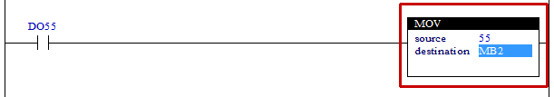

# 4.26 MOV(Move) : 이동

### 설명
Rung이 활성이면, "source"의 값을 "destination"에 복사합니다.  
만일, "source"가 워드(W)형식이고 "destination"이 바이트(B)형식이면, "source"의 값 중 하위 바이트만 "destination"에 복사됩니다.  
그리고, 내장 PLC의 모든 데이터는 부호가 있는 데이터로 처리하고 있기 때문에, "source"가 바이트(B) 형식이고 값이 -1(&Hff)인 경우 워드(W)형식의 "destination"으로 복사하면, -1(&HFFFF)로 복사합니다.(&H00ff는 255의 값이 됩니다.)

 

### 오퍼랜드로 사용할 수 있는 type
(X는 불가)

<table>
<thead>
  <tr>
    <th>relay type</th>
    <th colspan="2">input X, DO</th>
    <th colspan="2">output Y, DI</th>
    <th colspan="2">memory M, S</th>
    <th>const. 32bit</th>
  </tr>
  <tr>
    <th>data-type</th>
    <th>bit</th>
    <th>B,W,L,F</th>
    <th>bit</th>
    <th>B,W,L,F</th>
    <th>bit</th>
    <th>B,W,L,F</th>
    <th>L,F</th>
  </tr>
</thead>
<tbody>
  <tr>
    <td class='hd'>source</td>
    <td>X</td>
    <td></td>
    <td>X</td>
    <td></td>
    <td>X</td>
    <td></td>
    <td></td>
  </tr>
</tbody>
<tbody>
  <tr>
    <td class='hd'>destination</td>
    <td>X</td>
    <td>X</td>
    <td>X</td>
    <td></td>
    <td>X</td>
    <td></td>
    <td>X</td>
  </tr>
</tbody>
</table>

 

### 사용 예

입력 DO55가 활성화되면 내부 상태 MB2에 55가 설정됩니다.

