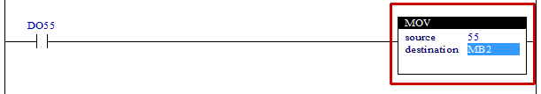

# 4.26 MOV (移动): Moving

### 说明
如果梯形图的 rung 是激活状态，“source”的值将被复制到“destination”。 如果“source”是字（W）格式，而“destination”是字节（B）格式，则“source”的值的低字节将仅被复制到“destination”。 因为嵌入式可编程逻辑控制器（PLC）的所有数据都作为有符号数据处理，如果“source”是字节（B）格式且其值为 -1(&Hff)，则该值将作为 -1(&HFFFF) 复制到字（W）格式的“destination”（&H00ff 变为 255 的值。）

 

### 可用作操作数的类型
(不适用于 X)

<table>
<thead>
  <tr>
    <th>继电器类型</th>
    <th colspan="2">输入 X, DO</th>
    <th colspan="2">输出 Y, DI, R, K</th>
    <th colspan="2">内存 M, S</th>
    <th>常量 32bit</th>
  </tr>
  <tr>
    <th>数据类型</th>
    <th>位</th>
    <th>B,W,L,F</th>
    <th>位</th>
    <th>B,W,L,F</th>
    <th>位</th>
    <th>B,W,L,F</th>
    <th>L,F</th>
  </tr>
</thead>
<tbody>
  <tr>
    <td class='hd'>source</td>
    <td>X</td>
    <td></td>
    <td>X</td>
    <td></td>
    <td>X</td>
    <td></td>
    <td></td>
  </tr>
</tbody>
<tbody>
  <tr>
    <td class='hd'>destination</td>
    <td>X</td>
    <td>X</td>
    <td>X</td>
    <td></td>
    <td>X</td>
    <td></td>
    <td>X</td>
  </tr>
</tbody>
</table>

 

### 使用示例

如果输入 DO55 处于活动状态，55 将被设置在内部状态继电器 MB2 中。

