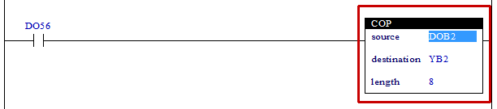

# 4.27 COP(Copy data) : 복사

### 설명
Rung이 활성이면, "source"의 위치에서부터 "length"수 만큼 "destination"의 위치로 값들을 복사합니다.  
"source"가 숫자인 경우, "destination"에서부터 "length"수 만큼의 "source"값으로 채워집니다. 이 경우 "destination"가 bit형식이면, "source"의 숫자가 0이면 OFF, 0이 아니면 ON으로 채워집니다.  
"source"가 릴레이인 경우, "source"와 "destination"의 데이터 형은 같아야 합니다. 즉, "source"가 비트이면 "destination"도 비트, "source"가 바이트(B)이면 "destination"도 바이트(B), "source"가 워드(W)이면 "destination"도 워드(W)라야 합니다.  
만일 "source"+"length"이 "source" 릴레이 최대개수보다 크거나, "destination"+"length"이 "destination" 릴레이 최대개수보다 큰 경우, 릴레이 최대개수까지만 복사를 진행합니다.

 

### 오퍼랜드로 사용할 수 있는 type
(X는 불가)

<table>
<thead>
  <tr>
    <th>relay type</th>
    <th colspan="2">input X, DO</th>
    <th colspan="2">output Y, DI, R, K</th>
    <th colspan="2">memory M, S</th>
    <th>const. 32bit</th>
  </tr>
  <tr>
    <th>data-type</th>
    <th>bit</th>
    <th>B,W,L,F</th>
    <th>bit</th>
    <th>B,W,L,F</th>
    <th>bit</th>
    <th>B,W,L,F</th>
    <th>L,F</th>
  </tr>
</thead>
<tbody>
  <tr>
    <td class='hd'>source</td>
    <td></td>
    <td></td>
    <td></td>
    <td></td>
    <td></td>
    <td></td>
    <td></td>
  </tr>
</tbody>
<tbody>
  <tr>
    <td class='hd'>destination</td>
    <td>X</td>
    <td>X</td>
    <td></td>
    <td></td>
    <td></td>
    <td></td>
    <td>X</td>
  </tr>
</tbody>
<tbody>
  <tr>
    <td class='hd'>length</td>
    <td>X</td>
    <td></td>
    <td>X</td>
    <td></td>
    <td>X</td>
    <td></td>
    <td></td>
  </tr>
</tbody>
</table>

 

### 사용 예

입력 DO56이 활성화되면 입력 DOB2부터 8바이트에 해당하는 값을 출력 YB2부터 8바이트로 복사합니다.

