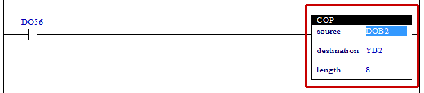

# 4.27 复制数据 (COP): 复制

### 描述
如果梯级处于活动状态，值将从“源”的位置复制到“目标”的位置，数量等于“长度”的值。
如果“源”是一个数字，则“目标”将用“源”的值填充，数量等于“长度”的值。在这种情况下，当“目标”处于位格式时，如果“源”的值为0，则“目标”将填充为OFF；如果“源”的值不为0，则“目标”将填充为ON。
如果“源”是继电器，则“源”和“目标”的数据类型必须相同。也就是说，如果“源”处于位格式，则“目标”也应处于位格式；如果“源”处于字节 (B) 格式，则“目标”应处于字节 (B) 格式；如果“源”处于字 (W) 格式，则“目标”也应处于字 (W) 格式。
如果“源” + “长度”大于“源”继电器的最大数量或“目标” + “长度”大于“目标”继电器的最大数量，那么复制操作将仅执行到最大数量的继电器为止。

 

### 可用作操作数的类型
(不适用于 X)

<table>
<thead>
  <tr>
    <th>继电器类型</th>
    <th colspan="2">输入 X, DO</th>
    <th colspan="2">输出 Y, DI, R, K</th>
    <th colspan="2">内存 M, S</th>
    <th>常量 32位</th>
  </tr>
  <tr>
    <th>数据类型</th>
    <th>位</th>
    <th>B,W,L,F</th>
    <th>位</th>
    <th>B,W,L,F</th>
    <th>位</th>
    <th>B,W,L,F</th>
    <th>L,F</th>
  </tr>
</thead>
<tbody>
  <tr>
    <td class='hd'>源</td>
    <td></td>
    <td></td>
    <td></td>
    <td></td>
    <td></td>
    <td></td>
<td></td>
  </tr>
</tbody>
<tbody>
  <tr>
    <td class='hd'>目标</td>
    <td>X</td>
    <td>X</td>
    <td></td>
    <td></td>
    <td></td>
    <td></td>
    <td>X</td>
  </tr>
</tbody>
<tbody>
  <tr>
    <td class='hd'>长度</td>
    <td>X</td>
    <td></td>
    <td>X</td>
    <td></td>
    <td>X</td>
    <td></td>
    <td></td>
  </tr>
</tbody>
</table>

 

### 使用示例

如果输入 DO56 处于活动状态，则对应 8 字节的值将从输入 DOB2 复制到输出 YB2，作为对应的 8 字节的值。

