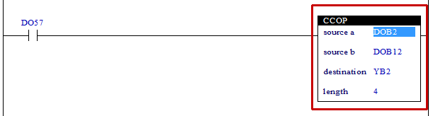

# 4.28 Conditional Copy Data (CCOP): Conditional Copying

### Description
Depending on the state of the rung, values will be copied from the location of the “source a” or “source b” to the location of the “destination” as many as the number of the “length.”
If the “source” is a number, the “destination” will be filled with the relevant value as much as the value of the “length.”. In this case, when the “destination” is in bit format, if the relevant value is 0, the “destination” will be filled with OFFs, and if the relevant value is not 0, the “destination” will be filled with ONs.
If the “source” is a relay, the data types of the “source” and “destination” should be the same. That is, if the “source” is in the bit format, the “destination” should be in the bit format; if the “source” is in the byte (B) format, then the “destination” should be in the byte (B) format; if the “source” is in the word (W) format, then the “destination” should also be in the word (W) format.
If the “source” + “length” is greater than the maximum number of the “source” relays or the “destination” + “length” is greater than the maximum number of “destination” relays, copying will be performed only up to the maximum number of relays.

 

### Types that can be used as an operant
(not possible for X)

<table>
<thead>
  <tr>
    <th>relay type</th>
    <th colspan="2">input X, DO</th>
    <th colspan="2">output Y, DI, R, K</th>
    <th colspan="2">memory M, S</th>
    <th>const. 32bit</th>
  </tr>
  <tr>
    <th>data-type</th>
    <th>bit</th>
    <th>B,W,L,F</th>
    <th>bit</th>
    <th>B,W,L,F</th>
    <th>bit</th>
    <th>B,W,L,F</th>
    <th>L,F</th>
  </tr>
</thead>
<tbody>
  <tr>
    <td class='hd'>source a</td>
    <td></td>
    <td></td>
    <td></td>
    <td></td>
    <td></td>
    <td></td>
    <td></td>
  </tr>
</tbody>
<tbody>
  <tr>
    <td class='hd'>source b</td>
    <td></td>
    <td></td>
    <td></td>
    <td></td>
    <td></td>
    <td></td>
    <td></td>
  </tr>
</tbody>
<tbody>
  <tr>
    <td class='hd'>destination</td>
    <td>X</td>
    <td>X</td>
    <td></td>
    <td></td>
    <td></td>
    <td></td>
    <td>X</td>
  </tr>
</tbody>
<tbody>
  <tr>
    <td class='hd'>length</td>
    <td>X</td>
    <td></td>
    <td>X</td>
    <td></td>
    <td>X</td>
    <td></td>
    <td></td>
  </tr>
</tbody>
</table>

 

### Example of use

If the input DO57 is active, the value corresponding to 4 bytes will be copied from the input DOB2 to the output YB2 as a value corresponding to 4 bytes. On the contrary, if the input DO57 is active, the value corresponding to 4 bytes will be copied from the input DOB12 to the output YB2 as a value corresponding to 4 bytes.

