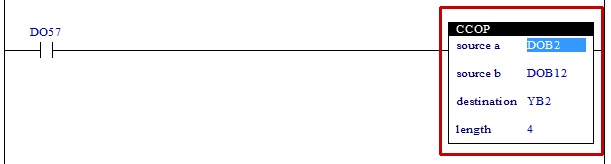

# 4.28 条件复制数据 (CCOP)：条件复制

### 描述
根据梯级的状态，值将从“源 a”或“源 b”的位置复制到“目的地”的位置，复制数量为“长度”的值。
如果“源”是一个数字，则“目的地”将填充为与“长度”值相等的相关值。在这种情况下，当“目的地”为比特格式时，如果相关值为 0，则“目的地”将填充 OFF；如果相关值不为 0，则“目的地”将填充 ON。
如果“源”是一个继电器，则“源”和“目的地”的数据类型应相同。也就是说，如果“源”是比特格式，则“目的地”也应为比特格式；如果“源”是字节 (B) 格式，则“目的地”应为字节 (B) 格式；如果“源”是字 (W) 格式，则“目的地”也应为字 (W) 格式。
如果“源” + “长度”大于“源”继电器的最大数量，或者“目的地” + “长度”大于“目的地”继电器的最大数量，则复制仅直到最大继电器数量为止。

 

### 可用作运算符的类型
(对于 X 不适用)

<table>
<thead>
  <tr>
    <th>继电器类型</th>
    <th colspan="2">输入 X, DO</th>
    <th colspan="2">输出 Y, DI, R, K</th>
    <th colspan="2">存储器 M, S</th>
    <th>常量 32位</th>
  </tr>
  <tr>
    <th>数据类型</th>
    <th>比特</th>
    <th>B,W,L,F</th>
    <th>比特</th>
    <th>B,W,L,F</th>
    <th>比特</th>
    <th>B,W,L,F</th>
    <th>L,F</th>
  </tr>
</thead>
<tbody>
  <tr>
    <td class='hd'>源 a</td>
    <td></td>
    <td></td>
    <td></td>
    <td></td>
    <td></td>
    <td></td>
<td></td>
  </tr>
</tbody>
<tbody>
  <tr>
    <td class='hd'>源 b</td>
    <td></td>
    <td></td>
    <td></td>
    <td></td>
    <td></td>
    <td></td>
    <td></td>
  </tr>
</tbody>
<tbody>
  <tr>
    <td class='hd'>目的地</td>
    <td>X</td>
    <td>X</td>
    <td></td>
    <td></td>
    <td></td>
    <td></td>
    <td>X</td>
  </tr>
</tbody>
<tbody>
  <tr>
    <td class='hd'>长度</td>
    <td>X</td>
    <td></td>
    <td>X</td>
    <td></td>
    <td>X</td>
    <td></td>
    <td></td>
  </tr>
</tbody>
</table>

 

### 使用示例

如果输入 DO57 激活，来自输入 DOB2 的 4 字节值将作为对应的 4 字节值复制到输出 YB2。相反，如果输入 DO57 激活，来自输入 DOB12 的 4 字节值将作为对应的 4 字节值复制到输出 YB2。

