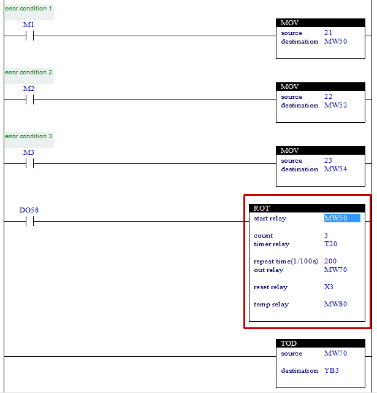

# 4.29 ROT(Rotating Output) : 순차 출력

### 설명
Rung이 활성이면, "start relay"부터 "count" 범위내의 릴레이 값이 0이 아닌 값을 "repeat time" 동안 "out relay"에 반복적으로 출력합니다.  
만일, "reset relay"에 신호가 입력되면, "start relay"부터 "count"수 만큼 전부 0으로 채우고, 타이머 값을 "repeat time"값으로 초기화 하며, "out relay"도 0으로 출력합니다.  
이 명령은 에러번호를 출력하는 장치가 한 개 밖에 없으나, 발생하는 에러의 종류가 많을 경우, 발생한 에러번호를 지정한 시간 동안 출력하는 용도에 매우 편리하게 사용할 수 있습니다.

 

### 오퍼랜드로 사용할 수 있는 type
(X는 불가)

<table>
<thead>
  <tr>
    <th>relay type</th>
    <th colspan="2">input X, DO</th>
    <th colspan="2">output Y, DI</th>
    <th colspan="2">memory M, S</th>
    <th colspan="2">timer T</th>
    <th>const. 32bit</th>
  </tr>
  <tr>
    <th>data-type</th>
    <th>bit</th>
    <th>B,W,L,F</th>
    <th>bit</th>
    <th>B,W,L,F</th>
    <th>bit</th>
    <th>B,W,L,F</th>
    <th>bit</th>
    <th>B,W,L,F</th>
    <th>L,F</th>
  </tr>
</thead>
<tbody>
  <tr>
    <td class='hd'>start relay</td>
    <td>X</td>
    <td></td>
    <td>X</td>
    <td></td>
    <td>X</td>
    <td></td>
    <td>X</td>
    <td>X</td>
    <td>X</td>
  </tr>
</tbody>
<tbody>
  <tr>
    <td class='hd'>count</td>
    <td>X</td>
    <td></td>
    <td>X</td>
    <td>X</td>
    <td>X</td>
    <td></td>
    <td>X</td>
    <td>X</td>
    <td></td>
  </tr>
</tbody>
<tbody>
  <tr>
    <td class='hd'>timer relay</td>
    <td>X</td>
    <td>X</td>
    <td>x</td>
    <td>X</td>
    <td>X</td>
    <td>X</td>
    <td></td>
    <td>X</td>
    <td>X</td>
  </tr>
</tbody>
<tbody>
  <tr>
    <td class='hd'>repeat time</td>
    <td>X</td>
    <td></td>
    <td>X</td>
    <td></td>
    <td>X</td>
    <td></td>
    <td>X</td>
    <td>X</td>
    <td></td>
  </tr>
</tbody>
<tbody>
  <tr>
    <td class='hd'>out relay</td>
    <td>X</td>
    <td>X</td>
    <td>X</td>
    <td></td>
    <td>X</td>
    <td></td>
    <td>X</td>
    <td>X</td>
    <td>X</td>
  </tr>
</tbody>
<tbody>
  <tr>
    <td class='hd'>reset relay</td>
    <td></td>
    <td>X</td>
    <td></td>
    <td>X</td>
    <td></td>
    <td>X</td>
    <td>X</td>
    <td>X</td>
    <td>X</td>
  </tr>
</tbody>
<tbody>
  <tr>
    <td class='hd'>temp relay</td>
    <td>X</td>
    <td>X</td>
    <td>X</td>
    <td></td>
    <td>X</td>
    <td></td>
    <td>X</td>
    <td>X</td>
    <td>X</td>
  </tr>
</tbody>
</table>

 

### 사용 예

에러조건 1~3중에 한 개 이상의 에러가 발생하면, 에러번호가 MW50~MW55에 저장됩니다. 여기서 입력 DO58이 활성화되면 ROT명령에 의해 발생한 에러번호가 MW70에 2초 동안 저장되고, TOD명령으로 BCD값으로 변환되어 YB3에 연결된 표시장치에 순차적으로 표시됩니다.  
만일, 외부 에러리셋에 연결된 X3에 신호가 입력되면, 에러번호가 저장된 MW51~MW55의 내용이 0으로 클리어 되고, MW70과 MW80도 0으로 클리어 되어, 표시장치에 0이 표시됩니다. 

