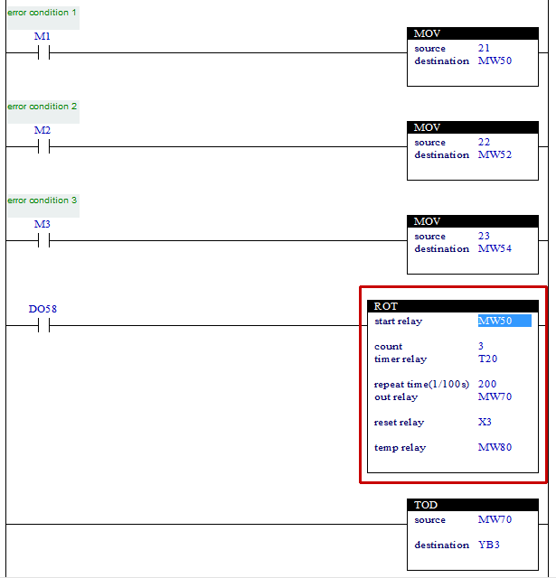

# 4.29 ROT (旋转输出): 旋转输出

### 描述
如果梯级处于活动状态，则在“计数”范围内的非0继电器值将在“开始继电器”到“输出继电器”之间输入，持续时间为“重复时间”。如果“复位继电器”有信号输入，则“开始继电器”将根据“计数”的数量被填充为0，定时器的值将初始化为“重复时间”的值，且“输出继电器”将输出0。该指令在需要在仅可输出错误编号的设备可用的情况下输出特定时间的错误编号时，可以非常方便地使用，尽管可能发生多种类型的错误。

 

### 可以用作操作数的类型
(对于 X 不可能)

<table>
<thead>
  <tr>
    <th>继电器类型</th>
    <th colspan="2">输入 X, DO</th>
    <th colspan="2">输出 Y, DI, R, K</th>
    <th colspan="2">内存 M, S</th>
    <th colspan="2">定时器 T</th>
    <th>常量 32位</th>
  </tr>
  <tr>
    <th>数据类型</th>
    <th>位</th>
    <th>B,W,L,F</th>
    <th>位</th>
    <th>B,W,L,F</th>
    <th>位</th>
    <th>B,W,L,F</th>
    <th>位</th>
    <th>B,W,L,F</th>
    <th>L,F</th>
  </tr>
</thead>
<tbody>
  <tr>
    <td class='hd'>开始继电器</td>
    <td>X</td>
    <td></td>
    <td>X</td>
    <td></td>
    <td>X</td>
<td></td>
<td>X</td>
<td>X</td>
<td>X</td>
</tr>
</tbody>
<tbody>
<tr>
<td class='hd'>计数</td>
<td>X</td>
<td></td>
<td>X</td>
<td>X</td>
<td>X</td>
<td></td>
<td>X</td>
<td>X</td>
<td></td>
</tr>
</tbody>
<tbody>
<tr>
<td class='hd'>定时继电器</td>
<td>X</td>
<td>X</td>
<td>x</td>
<td>X</td>
<td>X</td>
<td>X</td>
<td></td>
<td>X</td>
<td>X</td>
</tr>
</tbody>
<tbody>
<tr>
<td class='hd'>重复时间</td>
<td>X</td>
<td></td>
<td>X</td>
<td></td>
<td>X</td>
<td></td>
<td>X</td>
<td>X</td>
<td></td>
</tr>
</tbody>
<tbody>
<tr>
<td class='hd'>输出继电器</td>
    <td>X</td>
    <td>X</td>
    <td>X</td>
    <td></td>
    <td>X</td>
    <td></td>
    <td>X</td>
    <td>X</td>
    <td>X</td>
  </tr>
</tbody>
<tbody>
  <tr>
    <td class='hd'>复位继电器</td>
    <td></td>
    <td>X</td>
    <td></td>
    <td>X</td>
    <td></td>
    <td>X</td>
    <td>X</td>
    <td>X</td>
    <td>X</td>
  </tr>
</tbody>
<tbody>
  <tr>
    <td class='hd'>温度继电器</td>
    <td>X</td>
    <td>X</td>
    <td>X</td>
    <td></td>
    <td>X</td>
    <td></td>
    <td>X</td>
    <td>X</td>
    <td>X</td>
  </tr>
</tbody>
</table>

 

### 使用示例

如果存在一个或多个与错误条件1到3相关的错误，则错误编号将存储在MW50-MW55。在这里，当输入DO58激活时，由ROT指令生成的错误编号将存储在MW70中，持续2秒，同时该数字将通过TOD指令转换为BCD值，并依次显示在连接到YB3的显示设备上。如果连接的X3有输入信号，用于外部错误复位信号，则存储错误编号的MW51-MW55的内容将被清零，MW70和MW80也将清零，并且显示设备将相应地显示0。

