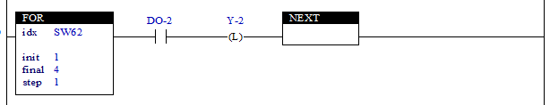

# 4.30 FOR (FOR): Repeating the Block

### Description
If the rung is active, the block up to the Next instruction will be executed repeatedly, while the "idx" relay value increase by as much as the "step" value from the "init" value to the "final" value.
When the FOR instruction is executed, the "init" value should be unconditionally substituted with the "idx' relay.
The FOR/NEXT instruction can be nested up to 10. For example: → FOR() FOR() FOR() … .NEXT NEXT NEXT
In a state where the "step" value is greater than 0, if the "init" value is greater than the "final" value, no execution will occur. Instead, jumping to the Next instruction will occur.
In a state where the "step" value is less than 0, if the "init" value is less than the "final" value, no execution will occur. Instead, jumping to the Next instruction will occur.
The "final" and "step" can be designated as variables. However, only the values ​​at the point when the FOR instruction started will be used.
To leave in the middle of a FOR instruction under special circumstances, the JMP (negative number) instruction, which will be described later, can be used (refer to the description of the JMP instruction).
Caution: The FOR instruction does not have any additional processing for branching.
Note: For more details on the NEXT instruction, refer to [4.31 NEXT (NEXT)](./31-next)

 

### Types that can be used as an operand
(not possible for X)

<table>
<thead>
  <tr>
    <th>relay type</th>
    <th colspan="2">input X, DO</th>
    <th colspan="2">output Y, DI, R, K</th>
    <th colspan="2">memory M, S</th>
    <th>const. 32bit</th>
  </tr>
  <tr>
    <th>data type</th>
    <th>bit</th>
    <th>B,W,L,F</th>
    <th>bit</th>
    <th>B,W,L,F</th>
    <th>bit</th>
    <th>B,W,L,F</th>
    <th>L,F</th>
  </tr>
</thead>
<tbody>
  <tr>
    <td class='hd'>idx</td>
    <td>X</td>
    <td>X</td>
    <td>X</td>
    <td></td>
    <td>X</td>
    <td></td>
    <td>X</td>
  </tr>
</tbody>
<tbody>
  <tr>
    <td class='hd'>initial</td>
    <td>X</td>
    <td></td>
    <td>X</td>
    <td></td>
    <td>X</td>
    <td></td>
    <td></td>
  </tr>
</tbody>
<tbody>
  <tr>
    <td class='hd'>final</td>
    <td>X</td>
    <td></td>
    <td>X</td>
    <td></td>
    <td>X</td>
    <td></td>
    <td></td>
  </tr>
</tbody>
<tbody>
  <tr>
    <td class='hd'>step</td>
    <td>X</td>
    <td></td>
    <td>X</td>
    <td></td>
    <td>X</td>
    <td></td>
    <td></td>
  </tr>
</tbody>
</table>

 

### Example of use

The instruction {XIC(DO-2), OTL(Y-2)} will be executed in repetition, while the value will increase by 1 from 1 to 4 in SW62.  
In other words, in a state where “idx” is using a relay for relative addressing (SW62–SW79), and the DO relay of the XIC instruction and the Y relay of the OTL instruction are “-2”, the number in the value of SW62 will be applied. Therefore, the Y relay number corresponding to the number of a signal in the High state among DO1–DO4 will be outputted in the High state, while the Y output of the number that is not inputted will retain its previous state. 
Note: Relative addressing refers to a method where the relay address will be designated to a value stored in SW62–SW79 if the relevant relay is set to a number ranging from -2 to -9 regardless of the type of relay.

