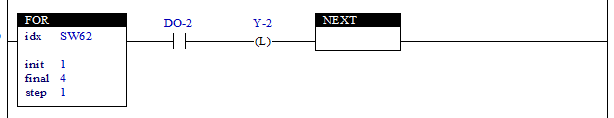

# 4.30 FOR (FOR): 重复块

### 描述
如果 rung 是活动的，直到 Next 指令的块将被反复执行，而 "idx" 继电器值从 "init" 值以 "step" 值的大小增加到 "final" 值。
当执行 FOR 指令时，"init" 值应无条件替代为 "idx" 继电器。
FOR/NEXT 指令可以嵌套最多 10 次。例如：→ FOR() FOR() FOR() ... .NEXT NEXT NEXT
在 "step" 值大于 0 的状态下，如果 "init" 值大于 "final" 值，则不会发生任何执行。相反，将跳转到 Next 指令。
在 "step" 值小于 0 的状态下，如果 "init" 值小于 "final" 值，则不会发生任何执行。相反，将跳转到 Next 指令。
"final" 和 "step" 可以指定为变量。然而，仅在 FOR 指令开始时的值将被使用。
在特殊情况下，要在 FOR 指令中途离开，可以使用后面将要描述的 JMP（负数）指令（请参阅 JMP 指令的描述）。
注意：FOR 指令没有任何额外的分支处理。
注意：有关 NEXT 指令的更多详细信息，请参阅 [4.31 NEXT (NEXT)](./31-next)

 

### 可以用作操作数的类型
（X 不可用）

<table>
<thead>
  <tr>
    <th>继电器类型</th>
    <th colspan="2">输入 X, DO</th>
    <th colspan="2">输出 Y, DI, R, K</th>
    <th colspan="2">内存 M, S</th>
    <th>常量 32bit</th>
  </tr>
  <tr>
    <th>数据类型</th>
    <th>位</th>
    <th>B,W,L,F</th>
    <th>位</th>
    <th>B,W,L,F</th>
    <th>位</th>
    <th>B,W,L,F</th>
    <th>L,F</th>
  </tr>
</thead>
<tbody>
  <tr>
    <td class='hd'>idx</td>
    <td>X</td>
    <td>X</td>
    <td>X</td>
    <td></td>
    <td>X</td>
    <td></td>
    <td>X</td>
  </tr>
</tbody>
<tbody>
  <tr>
    <td class='hd'>初始</td>
    <td>X</td>
    <td></td>
    <td>X</td>
    <td></td>
    <td>X</td>
    <td></td>
    <td></td>
  </tr>
</tbody>
<tbody>
  <tr>
    <td class='hd'>结束</td>
    <td>X</td>
    <td></td>
    <td>X</td>
    <td></td>
    <td>X</td>
    <td></td>
    <td></td>
  </tr>
</tbody>
<tbody>
  <tr>
    <td class='hd'>步长</td>
    <td>X</td>
    <td></td>
    <td>X</td>
    <td></td>
    <td>X</td>
    <td></td>
    <td></td>
  </tr>
</tbody>
</table>

 

### 使用示例

指令 {XIC(DO-2), OTL(Y-2)} 将在 SW62 中的值从 1 增加到 4 的同时反复执行。  
换句话说，在 "idx" 使用相对寻址的继电器状态（SW62-SW79）中，XIC 指令的 DO 继电器和 OTL 指令的 Y 继电器都是 "-2"，SW62 中的值将被应用。因此，与 DO1-DO4 中高状态信号的数字对应的 Y 继电器将以高状态输出，而没有输入的数字的 Y 输出将保持其先前状态。  
注意：相对寻址是指在相关继电器被设置为 -2 到 -9 范围内的数字时，继电器地址将指定为存储在 SW62-SW79 中的值，无论其类型如何。

