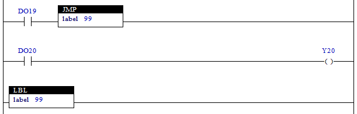

# 4.33 JMP(Jump) : 점프

### 설명
Rung이 활성이면, "label"로 지정한 레이블의 값과 일치하는 LBL명령이 있는 위치로 점프합니다.  
특별하게 "label"을 0보다 작은 값으로 지정한 경우에는 FOR문의 중간에서 빠져나가는 기능으로 사용할 수 있습니다. (음수로 지정한 수만큼 skip함)  
주의1)  
레이블의 위치가 JMP명령보다 위쪽에 있고, JMP명령 앞에 조건이 없을 경우에는 무한 루프에 빠질 수 있으므로 주의하십시오. 이 경우, 스캔타임이 5초를 초과하기 때문에 S16=1으로 설정됩니다.  
주의2)  
FOR/NEXT명령 블록 내에서 JMP(양수)를 사용하여 블록을 빠져나가는 경우는 블록제어가 잘못될 수 있습니다. 이 경우에는 JMP(음수)를 이용하여 NEXT명령까지 건너뛸 수 있도록 프로그램 해야 합니다.  
참고) LBL 명령에 대한 내용은 [4.32 LBL(Label)](./32-lbl)를 참조하십시오.

 

### 오퍼랜드로 사용할 수 있는 type
(X는 불가)

<table>
<thead>
  <tr>
    <th>relay type</th>
    <th colspan="2">input X, DO</th>
    <th colspan="2">output Y, DI</th>
    <th colspan="2">memory M, S</th>
    <th>const. 32bit</th>
  </tr>
  <tr>
    <th>data-type</th>
    <th>bit</th>
    <th>B,W,L,F</th>
    <th>bit</th>
    <th>B,W,L,F</th>
    <th>bit</th>
    <th>B,W,L,F</th>
    <th>L,F</th>
  </tr>
</thead>
<tbody>
  <tr>
    <td class='hd'>idx</td>
    <td>X</td>
    <td>X</td>
    <td>X</td>
    <td>X</td>
    <td>X</td>
    <td>X</td>
    <td></td>
  </tr>
</tbody>
</table>

 

### 사용 예

입력 DO19가 활성화되면 JMP 명령의 "label 99"에 의해 해당 LBL의 명령으로 jump하여 실행합니다. 즉, {XIC(DO20), OTE(Y20)}명령은 실행되지 않습니다.  
만약 입력 DO19가 비활성화되면 JMP 명령은 실행되지 않으므로 다음 Rung에 작성된 {XIC(DO20), OTE(Y20)}명령을 실행합니다.

