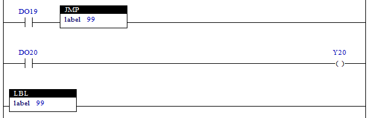

# 4.33 JMP (Jump): 跳转

### 描述
如果该 rung 是活动状态，则会跳转到与“label”中指定的标签值匹配的 LBL 指令所在的位置。特别地，如果“label”指定为小于 0 的值，则可以作为离开 FOR 指令中间的特性使用（按负数指定的数量跳过）。
注意事项 1：  
如果标签的位置在 JMP 指令的上方，并且在 JMP 指令前没有条件，则可能会发生无限循环，这将需要您的注意。当发生此情况时，设置将是 S16=1，因为扫描时间超过 5 秒。
注意事项 2：  
在 FOR/NEXT 指令块中使用 JMP（正数）指令离开该块可能会导致块控制出错。在这种情况下，需要编写一种方法，通过使用 JMP 指令（负数）跳转到 NEXT 指令。
注意：有关 LBL 指令的更多详情，请参阅 [4.32 LBL (Label)](./32-lbl)

 

### 可用作操作数的类型
(不适用于 X)

<table>
<thead>
  <tr>
    <th>继电器类型</th>
    <th colspan="2">输入 X, DO</th>
    <th colspan="2">输出 Y, DI, R, K</th>
    <th colspan="2">内存 M, S</th>
    <th>常量 32位</th>
  </tr>
  <tr>
    <th>数据类型</th>
    <th>位</th>
    <th>B,W,L,F</th>
    <th>位</th>
    <th>B,W,L,F</th>
    <th>位</th>
    <th>B,W,L,F</th>
    <th>L,F</th>
  </tr>
</thead>
<tbody>
  <tr>
    <td class='hd'>idx</td>
    <td>X</td>
    <td>X</td>
    <td>X</td>
    <td>X</td>
    <td>X</td>
    <td>X</td>
    <td></td>
  </tr>
</tbody>
</table>

 

### 使用示例

如果输入 DO19 是活动的，将会根据 JMP 指令的“label 99”跳转到相关的 LBL 指令。这意味着指令 {XIC(DO20), OTE(Y20)} 将不会被执行。  
如果输入 DO19 是非活动的，则 JMP 指令将不会被执行，因此在下一个 rung 中写的 {XIC(DO20), OTE(Y20)} 指令将被执行。

