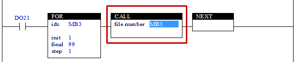

# 4.34 CALL (Call): 调用子梯程序

### 描述
如果梯级处于活动状态，将调用由“文件编号”指定的子梯程序，编号范围为（1到99）。
子梯程序最多可以有99个文件名，范围从 S01xxxx.LAD 到 S99xxxx.LAD，文件名的“xxxx”部分，用户可以任意添加最多15个字符。

 

### 可用作操作数的类型
(对于 X 不可用)

<table>
<thead>
  <tr>
    <th>继电器类型</th>
    <th colspan="2">输入 X, DO</th>
    <th colspan="2">输出 Y, DI, R, K</th>
    <th colspan="2">内存 M, S</th>
    <th>常数 32位</th>
  </tr>
  <tr>
    <th>数据类型</th>
    <th>位</th>
    <th>B,W,L,F</th>
    <th>位</th>
    <th>B,W,L,F</th>
    <th>位</th>
    <th>B,W,L,F</th>
    <th>L,F</th>
  </tr>
</thead>
<tbody>
  <tr>
    <td class='hd'>idx</td>
    <td>X</td>
    <td></td>
    <td>X</td>
    <td></td>
    <td>X</td>
    <td></td>
    <td></td>
  </tr>
</tbody>
</table>

 

### 使用示例

当输入 DO21 激活时，从 S01xxxx.LAD 到 S99xxxx.LAD 的文件将会轮流调用。
如果执行 CALL 指令时，与该编号相关的子梯级程序不存在，或该编号的值超出了 1 到 99 的范围，将会设置 S17=1。但是，如果 CALL 指令正常执行，将会设置 S17=0。因此，在应该有必要的子梯级的情况下，可以在调用后通过使用 S17 检测错误。  
如果在主梯级程序中使用 CALL 指令调用编号从 1 到 99 的子梯级，并为每个应用分配一个子梯级编号是可能的，那么我们可以期望通过控制器根据每个应用自动加载必要的子梯级程序以执行与应用相关的梯级程序。  

