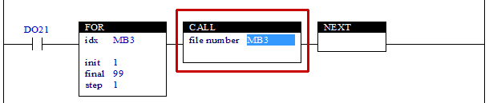

# 4.34 CALL(Call) : 서브래더 호출

### 설명
Rung이 활성이면, "file number"로 지정하는 번호(1 ~ 99)의 서브래더를 호출합니다.  
서브래더의 파일명은 S01xxxx.LAD ~ S99xxxx.LAD으로 최대 99개가 있을 수 있으며, 파일명의 xxxx은 최대 15글자까지 사용자가 임의로 붙일 수 있습니다.

 

### 오퍼랜드로 사용할 수 있는 type
(X는 불가)

<table>
<thead>
  <tr>
    <th>relay type</th>
    <th colspan="2">input X, DO</th>
    <th colspan="2">output Y, DI, R, K</th>
    <th colspan="2">memory M, S</th>
    <th>const. 32bit</th>
  </tr>
  <tr>
    <th>data-type</th>
    <th>bit</th>
    <th>B,W,L,F</th>
    <th>bit</th>
    <th>B,W,L,F</th>
    <th>bit</th>
    <th>B,W,L,F</th>
    <th>L,F</th>
  </tr>
</thead>
<tbody>
  <tr>
    <td class='hd'>idx</td>
    <td>X</td>
    <td></td>
    <td>X</td>
    <td></td>
    <td>X</td>
    <td></td>
    <td></td>
  </tr>
</tbody>
</table>

 

### 사용 예

입력 DO21이 활성화되면 S01xxxx.LAD부터 S99xxxx.LAD의 파일을 순차 호출합니다.  
CALL명령 실행결과, 해당 번호의 서브래더가 존재하지 않거나 값의 범위가 1~99를 벗어나면 S17=1으로 설정되고, 정상적으로 실행되면 S17=0으로 됩니다. 따라서 필요에 따라 서브래더가 있어야만 하는 경우에는 호출 후 S17을 이용하여 에러검출이 가능합니다.  
메인 래더에서 CALL명령으로 1~99번까지의 서브래더를 호출하도록 하고, 응용 별로 서브래더 번호를 배정하면, 응용에 따라 필요한 서브래더만 제어기로 로딩하면 해당응용의 래더가 자동으로 실행되는 효과를 기대할 수 있습니다.

