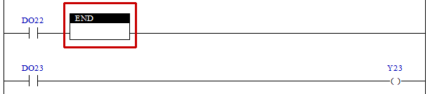

# 4.35 END(End) : 래더 종료

### 설명
Rung이 활성이면, 현재 실행되고 있는 래더를 종료합니다.  
만일 현재 실행하고 있는 래더가 서브래더이면 메인래더로 리턴 하고, 현재 실행하고 있는 래더가 메인래더이면, 실행을 종료하고 처음부터 다시 실행합니다.

 

### 사용 예

입력 DO22가 활성화되면 END 명령에 의해 래더가 종료되며 따라서  이후에 작성된 Rung의 명령들은 실행하지 않습니다.   
입력 DO22가 비활성화되면 END 명령이 실행되지 않으므로 자연스럽게 이후에 작성된 Rung의 명령들도 실행합니다.   

