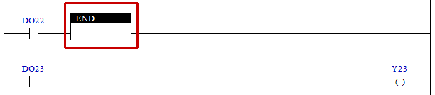

# 4.35 结束 (End): 结束梯形程序

### 描述
如果梯级处于活动状态，当前正在执行的梯形程序将被结束。 
如果当前梯形程序是子梯形程序，将返回主梯形程序。然而，如果当前梯形程序是主梯形程序，其执行将被结束，然后从头开始再次执行主梯形程序。

 

### 使用示例

如果输入 DO22 处于活动状态，梯形程序将通过 END 指令结束，随后的梯级指令将不会被执行。
如果输入 DO22 处于非活动状态，END 指令将不会被执行，允许后续的梯级指令自然地被执行。

