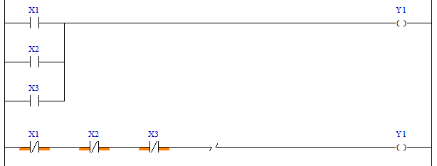

# 4.4 INV(Inverting) : 인버팅

### 설명
Rung의 이전까지의 결과를 반전(활성 <-> 비활성)시킵니다.

 

### 사용 예

이 처리는 드모르강의 법칙에 따라 /(AxB)=/A+/B, 또는 /(A+B)=/Ax/B로 되기 때문에, 여러 개의 브랜치로 OR로직을 구성해야 하는 것을 브랜치 없이, 간단하게 AND로직으로 구성할 수 있습니다.  
즉, (X1+X2+X3) = /(/X1x/X2x/X3)이므로 하기 두 rung의 로직은 같은 결과가 됩니다.

